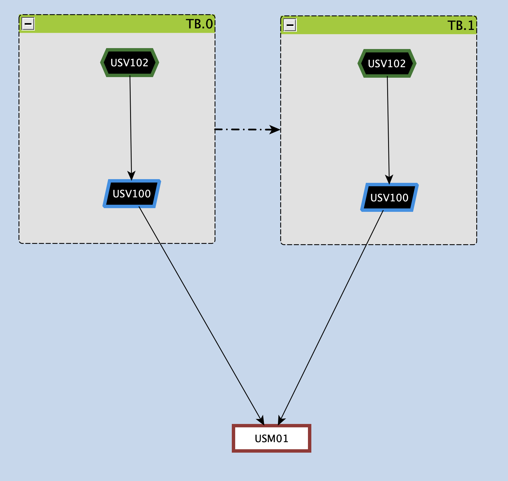

Time Branches Groups
====================

The *time branches* express alternate self-excludent hypotheses (i.e. two different reconstruction hypotheses of a roof of a Greek temple). Each *Time Branch* groups stratigraphic and paradata nodes (eventually organized in activities) by a `TimeBranchNodeGroup`, which is provided within the palette in the yED system for simplicity. Each time branch is visually characterized by a green header and indicates a potential temporal development of stratigraphic units, including their unique properties and the documents used to reconstruct them. 

Each time branch ereditates a defined start and end from the nodes it cluster, allowing it to span across multiple epochs. Two time branches can be mutually exclusive, with only one applied at a time, achieved by connecting them with the dashed-line connector included in the EM palette.

   
   *Formalization of two alternative reconstructive hypotheses using time branches.*
