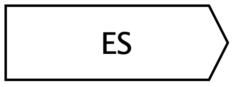

Auxiliary Stratigraphic nodes
=============================

Auxiliary Stratigraphic Nodes help us better understand how layers of earth and remains form and change over time. These units don't exist alone – they're always connected to main stratigraphic units and provide extra information about how the layers developed.

.. _continuity_node:

Continuity Node
---------------

One aspect that remained inadequately addressed in the Matrix for many years was the method of expressing the lifespan of a stratigraphic unit—specifically, the duration between its creation and its destruction. Although various hypotheses and proposals have been put forward, the literature lacked a solution that was coherent with the Matrix's graph-based structure.

In the Extended Matrix (EM), this temporal continuity is expressed through a continuity node (represented by a black diamond), which marks the end of a stratigraphic unit's life cycle. For example, when a wall collapses and is removed from the site, when wooden beams disappeared due to a fire or even during an excavation when a structure is destroyed (after it is fully documented). The beginning of the unit's life is marked by the stratigraphic unit itself.

This approach provides several advantages:

1. **Graph Consistency**: The continuity node maintains the graph-based nature of the Matrix while adding temporal depth
2. **Clear Temporal Boundaries**: It explicitly marks both the beginning (the stratigraphic unit) and end (the continuity node) of a unit's existence
3. **Relationship Integration**: The node can participate in the stratigraphic sequence, allowing clear representation of how one unit's end relates to other units' beginnings or endings
4. **Documentation Precision**: It enables precise documentation of when a unit ceased to function in its original capacity

The introduction of the continuity node resolves a long-standing limitation in stratigraphic documentation, providing a formal way to represent not just the creation of stratigraphic units but their complete lifecycle within the archaeological record.

Real vs virtual units: asymmetric semantics
~~~~~~~~~~~~~~~~~~~~~~~~~~~~~~~~~~~~~~~~~~~

The effect of a continuity node **depends on the type of unit it is attached to**. The EM treats real and virtual units asymmetrically, because they carry a different epistemic status.

**Attached to a real stratigraphic unit** (US, USM, USR, SU, SE …):
   The continuity node **declares the end of life** of the unit. Without a continuity node, a real unit is assumed to **persist** from its epoch of creation **until the end of the recorded periods** — physical evidence is taken as surviving unless proven otherwise. Adding a continuity node terminates that persistence at the epoch the continuity node belongs to.

   *Example*: a wall (SU05) is built in Epoch 2. With no continuity node it is considered still standing in Epochs 3, 4 and 5 as well. If a continuity node is attached to SU05 and placed in Epoch 4, the wall is treated as no longer present from Epoch 5 onward.

**Attached to a virtual stratigraphic unit** (USV/s, USV/n, SF, VSF and their series/group variants):
   The continuity node **extends the life** of the virtual unit. By default, a virtual unit exists only in the epoch where it is declared — because it represents a reconstruction hypothesis anchored to a single temporal slice. Attaching one or more continuity nodes artificially extends that hypothesis into additional epochs.

   *Example*: a hypothetical column (USV/n 100) is declared in Epoch 2. Without any continuity node it is visible only in Epoch 2. Attaching continuity nodes in Epochs 3 and 4 extends the reconstruction so that the column is also considered present in those epochs.

The continuity node is therefore the single mechanism that inverts the default temporal semantics depending on the realness of the unit:

- **real unit** → default = alive until the end; continuity node **ends** it.
- **virtual unit** → default = alive only in one epoch; continuity node **extends** it.

This asymmetry reflects the epistemic status of the two categories: physical evidence is assumed to survive until proven otherwise, while reconstructions are taken as local hypotheses unless explicitly propagated.

.. _se:

Stratigraphic Event Node
------------------------

A **Stratigraphic Event Node** represents an event or action that precedes and results in the formation of a stratigraphic unit. This new node captures not just the unit itself, but the process that leads to the creation, modification, or transformation of the unit. By introducing this concept, it is possible to model both the temporal and spatial dimensions of how a stratigraphic unit comes to exist.

**Definition**

A stratigraphic event is the process or event that leads to the formation or alteration of a stratigraphic unit. It is distinct from the unit itself, which represents the result or outcome of the event. The event can be thought of as a precursor and can be paired with its resulting unit to provide a more detailed temporal range. This allows for the documentation of both the initial moment of action (e.g., the start of construction, a collapse, or an incision) and the final state (the resulting unit that persists over time).

**Use Cases**

The inclusion of **Stratigraphic Event Nodes** is useful in cases where the event is significant enough to be recorded, either because it marks a key phase in the creation of the unit or because it involves complex interactions such as displacement, rotation, or fragmentation. 

For example:

1. **Construction of a Wall**:
   The stratigraphic event would document the beginning of the construction process, such as the laying of the foundation stone. The result of this event is the completion of the wall, which becomes a permanent stratigraphic unit. By defining the event separately, the duration of construction can be modeled, from the first stone laid to the final brick placed.

2. **Collapse of a Painted Ceiling**:
   When a ceiling collapses, the event can involve both displacement and rotation. For instance, a fragment of a painted ceiling might fall from a height of 3 meters and rotate 180 degrees before coming to rest on the floor. The event node captures the movement (spatial displacement, rotation) and the forces at play. The resulting stratigraphic unit would then be the fragments on the floor, possibly broken, but distinct from the original ceiling. 

3. **In case of bradisysm**:
   In the case of a bradisysm, a wall is no more in the same position as in the past: the present position is the found USM while the previous wall was simply 30 cm upper on the z axis: between such an original wall and the changed one (it changed the position due to the bradisysm) a Stratigraphic Event node is provided to ensure a full description of the bradisysm (using paradatat nodes).

4. **Fire**:
   Example in progress..

**Properties**

Each **Stratigraphic Event Node** can have the following properties:

- **Start Time**: The initiation of the event.
- **End Time**: The conclusion of the event (e.g., when the wall is completed or when the collapse ends).
- **Spatial Displacement**: If the event involves movement, this property records the spatial shift (e.g., distance fallen, rotation angle).
- **Cause**: The reason for the event, such as construction, collapse, or erosion.
- **Validation Source**: For events validated through simulations or analysis, this property records the source of validation.
- **Visualization**: A simulation can provide a clear way to represent it.

**Pairing with Stratigraphic Units**

Stratigraphic Event Nodes are always paired with their resulting stratigraphic units. This pairing creates a temporal link that captures the event’s duration and its outcome. In scenarios where multiple events lead to a single stratigraphic unit (e.g., incremental construction), multiple event nodes can be associated with the same unit.

It connects to these nodes:
~~~~~~~~~~~~~~~~~~~~~~~~~~~

* Stratigraphic Unit
* Property Node