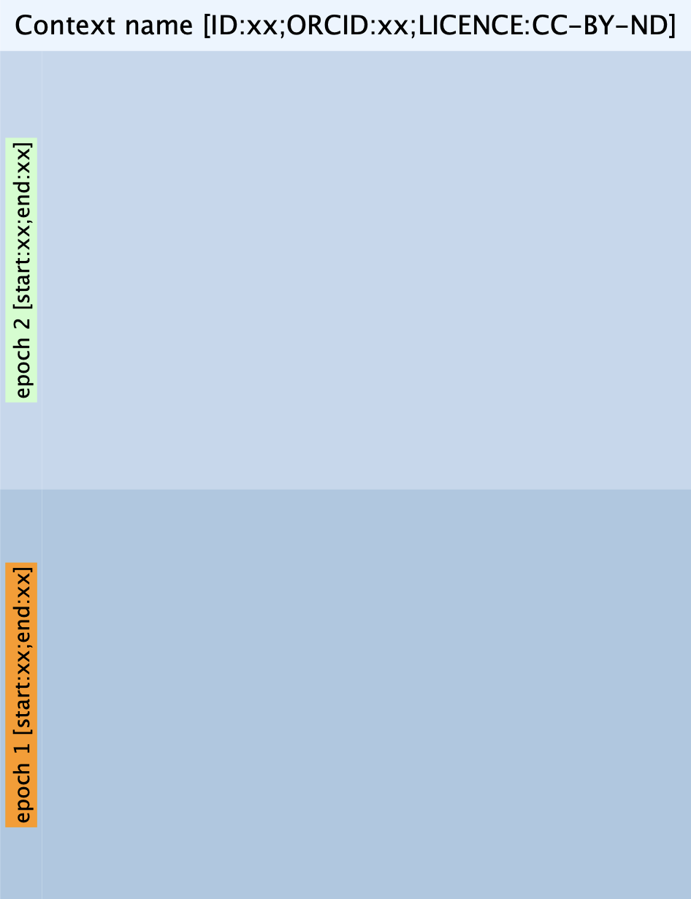

Canvas
======

The Extended Matrix is drawn within a canvas, which serves as the frame where all nodes and data are displayed, enabling their organization for a clear and effective representation of information.

   *The canvas where all the nodes are drawn.*

As in the Harris Matrix, the Y-axis represents time (newer elements at the top, older ones at the bottom). The canvas is typically divided into swimlanes (horizontal stripes) that define epochs (``EpochNode``) or time periods. These divisions are established during the study of the context (for instance, when analyzing a Roman villa) as a preliminary, macroscopic organization of the archaeological remains (including elements that are no longer present or were never built) into different historical phases. This division can be iteratively modified at any time by adding new swimlanes and moving the necessary nodes to their correct epoch.
The canvas can also be divided into sectors (``SectorNode``) , as vertical columns, to distinguish spatially separate areas of the site (such as the peristylium, room A, room B, fauces, etc.). At the top, there is a title that identifies the canvas. Formally, this title is a node and, like other nodes, can have a description (not mandatory) providing essential information.

The canvas enables one of the most powerful features of the Extended Matrix formal language: `the data funnel <>`_. It is recommended to thoroughly understand the fundamental concepts and analytical components presented so far, before exploring the advanced concept of data funnels.
