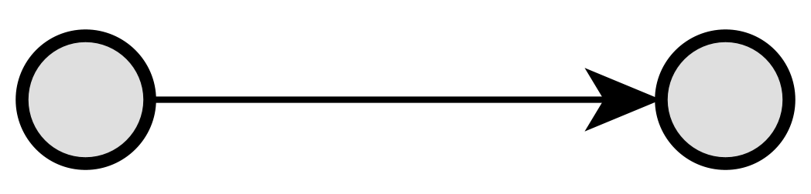
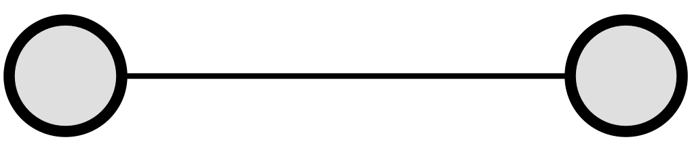
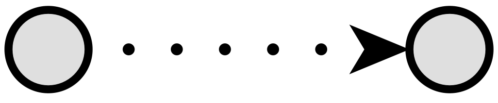
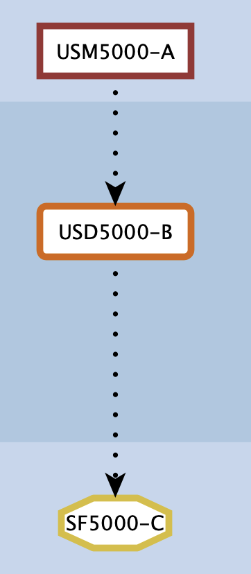
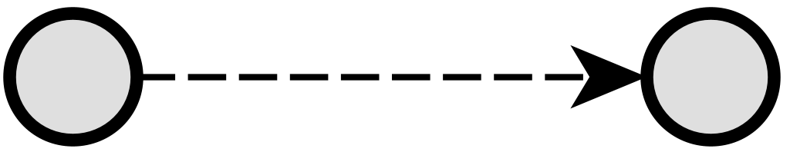
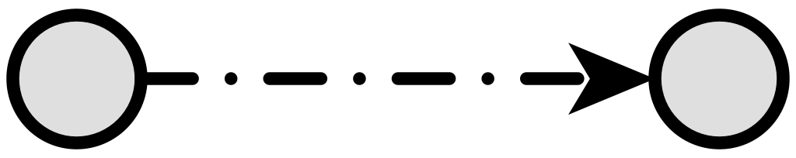
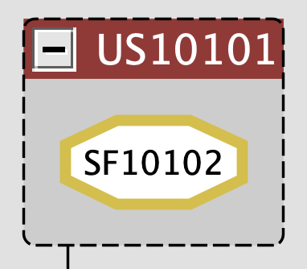

Connectors
==========

.. _emconnectors:

In the Extended Matrix formal language, connectors (or edges) represent relationships between different nodes in the stratigraphic documentation. These connections help establish temporal sequences, show relationships between elements, and document data provenance. Each connector type has specific rules about which kinds of nodes it can connect, ensuring that the resulting graph maintains logical consistency.

Connector Types
---------------

1. Chronological Relationships
------------------------------

These connectors establish temporal relationships between stratigraphic units.

.. _isbefore:

1.1. Is Before (``is_before``)
~~~~~~~~~~~~~~~~~~~~~~~~~

Indicates a temporal sequence where one stratigraphic unit occurs before another. This is one of the fundamental relationships in stratigraphic documentation, establishing the chronological order of events and formations.

**Allowed Connections:**
  * Source: Stratigraphic Unit
  * Target: Stratigraphic Unit

.. _hassametime:

1.2. Has Same Time (``has_same_time``)
~~~~~~~~~~~~~~~~~~~~~~~~~~~~~~~~

Indicates that two elements are contemporaneous, meaning they existed or were created at the same time. This relationship helps establish horizontal relationships in the stratigraphic sequence.

**Allowed Connections:**
  * Source: Stratigraphic Unit
  * Target: Stratigraphic Unit

.. _changedfrom:

1.3. Changed From (``changed_from``)
~~~~~~~~~~~~~~~~~~~~~~~~~~~~~~

Represents the transformation of an object over time, indicating that one stratigraphic unit evolved or changed into another form. This connector uses a **dotted line** in the GraphML representation.

**Allowed Connections:**
  * Source: Stratigraphic Unit (any subtype)
  * Target: Stratigraphic Unit (any subtype)

.. _instancechains:

Instance Chains
^^^^^^^^^^^^^^^

When the same conceptual object exists across multiple epochs -- each represented as a distinct stratigraphic unit -- the ``changed_from`` connector links these instances into a navigable **instance chain**. The chain is traversed transitively: if A ``changed_from`` B and B ``changed_from`` C, then A, B, and C form a single instance chain representing the complete biography of a physical object through time.

   Example of an instance chain: a capital exists today on the ground as a Special Find (SF5000-C), in a previous epoch as a collapsed element (USD5000-B), and in the Roman era in its original structural position (USM5000-A). The three nodes are linked by dotted connectors.

For example:

* A capital found on the ground today (Special Find, SF)
* The same capital as a collapsed element in a previous epoch (Documentary Stratigraphic Unit, USD)
* The same capital in its original Roman-era position (Stratigraphic Unit, US)

These three nodes are connected by ``changed_from`` edges, forming a chain that documents the complete life of a single physical object.

.. tip:: Naming Convention for Instance Chains

   A recommended (but not enforced) naming convention for instance chains is:
   ``{TYPE}{ID}-{LETTER}`` where the letter indicates the epoch order
   (A = most recent, B = previous, C = older, etc.).

   For example: ``USM5000-A``, ``USD5000-B``, ``SF5000-C``.

   This convention is purely organisational. The system relies solely on ``changed_from``
   edges to identify chains, never on name parsing.

.. note::
   The ``changed_from`` connector can link **any combination** of stratigraphic node types,
   including container nodes (US, USD, VSF acting as group nodes). Mixed-type chains
   (e.g., US to USD to SF) are fully supported and common in practice.

2. Provenance Relationships
--------------------------

.. _provenance:

2.1. Provenance (``provenance``)
~~~~~~~~~~~~~~~~~~~~~~~~~~

Represents all data and property provenance relationships in the Extended Matrix. This connector type is used to document how properties are associated with stratigraphic units, how data is extracted from sources, and how information is combined or synthesized.

**Allowed Connections:**
  * Between Stratigraphic Units and Property Nodes
  * Between Property Nodes and Extractor/Combiner Nodes
  * Between Extractor Nodes and Document Nodes
  * Between Combiner Nodes and Extractor Nodes

3. Special Relationships
-----------------------

These connectors handle specific cases and general relationships.

.. _contrastswith:

3.1. Contrasts With (``contrasts_with``)
~~~~~~~~~~~~~~~~~~~~~~~~~~~~~~~~

Represents contrasting or mutually exclusive time branches in the documentation.

**Allowed Connections:**
  * Source: Time Branch Node Group
  * Target: Time Branch Node Group

.. _genericconnection:

4. Containment Relationships
----------------------------

These connectors express mereological (part--whole) relationships between stratigraphic units.

.. _ispartof:

4.1. Is Part Of (``is_part_of``)
~~~~~~~~~~~~~~~~~~~~~~~~~~~~~~

Indicates physical containment: a node is physically contained within another stratigraphic unit. This relationship is **mereological** (part--whole), not chronological or stratigraphic.

In the GraphML representation, containment is expressed through **group nodes**: a container (US, USD, or VSF) is drawn as a yEd group node, and the contained elements (typically SF or VSF) are placed visually inside it. On import, s3Dgraphy converts this visual nesting into explicit ``is_part_of`` edges.

   Example of containment: a wall (US10101) contains a reused capital (SF10102). The SF is drawn inside the US group node in yEd. On import, an ``is_part_of`` edge is created from SF10102 to US10101.

**Common use cases:**

* A wall (US) contains a reused capital (SF) -- the SF ``is_part_of`` the US
* A reconstructed roof (VSF) is composed of tile fragments (SF) -- each SF ``is_part_of`` the VSF
* A documentary unit (USD) contains a special find (SF) identified through archival sources

**Allowed Connections:**
  * Source: Special Find (SF), Virtual Special Find (VSF)
  * Target: Stratigraphic Unit (US), Documentary Stratigraphic Unit (USD), Virtual Special Find (VSF)

.. note::
   The container node retains all its normal stratigraphic properties and relationships
   (epoch connections, temporal edges, activity membership, representation models, etc.).
   Containment is a relationship (edge), not a change in node type: a US that contains
   elements is still a US. The presence of ``is_part_of`` edges is the only discriminant
   that identifies a node as a container.

.. note::
   The reverse relationship ``has_part`` is automatically generated by s3Dgraphy.
   When querying from the container's perspective, use ``has_part``; when querying
   from the contained element's perspective, use ``is_part_of``.

Technical Implementation Notes
------------------------------

Provenance Implementation in s3dgraphy
~~~~~~~~~~~~~~~~~~~~~~~~~~~~~~~~~~~~

While the Extended Matrix formal language defines a single "provenance" connector type, the s3dgraphy library internally differentiates this connection based on the types of nodes being connected:

* When connecting a Stratigraphic Unit to a Property Node, it's treated as a "has_property" relationship
* When connecting a Property Node to an Extractor/Combiner Node, it's handled as a "has_data_provenance" relationship
* When connecting an Extractor Node to a Document Node, it's processed as an "extracted_from" relationship
* When connecting a Combiner Node to an Extractor Node, it's managed as a "combines" relationship

This internal differentiation allows s3dgraphy to maintain appropriate validation rules and processing logic while presenting a simplified connection model to users. The user has to do nothing, s3Dgrapy will take care of everything :-)

Swimlanes and Groups in the Multi-Knowledge Graph (MKG)
~~~~~~~~~~~~~~~~~~~~~~~~~~~~~~~~~~~~~~~~~~~~~~~~~~~~~~

In the visualization of the Extended Matrix, swimlanes and groups are represented as visual containers. However, s3dgraphy internally interprets these as nodes with specific connections to the elements they contain:

1. **Epoch Swimlanes**
   * Nodes within an epoch swimlane are connected to that epoch through two possible relationships:
     - ``has_first_epoch``: Indicates the swimlane where a stratigraphic unit first appears
     - ``survive_in_epoch``: Used for subsequent swimlanes where the unit continues to exist
   * The survival of a unit in subsequent epochs depends on its relationship with chronologically later continuity nodes

2. **Activity Groups**
   * Elements within an activity group are connected to the group through the ``has_activity`` relationship
   * This allows for the organization and categorization of related stratigraphic units based on common activities or events

3. **Time Branch Groups**
   * Nodes within a time branch group are connected to that group through the ``has_timebranch`` relationship
   * This structure enables the representation of alternative interpretations or hypotheses about the stratigraphic sequence

4. **Stratigraphic Container Groups (US, USD, VSF)**
   * A group node with a specific background color identifies a stratigraphic container:
     - ``#9B3333`` (dark red): US container (Stratigraphic Unit)
     - ``#D86400`` (orange): USD container (Documentary Stratigraphic Unit)
     - ``#B19F61`` (gold): VSF container (Virtual Special Find)
   * On import, the group node is converted into a regular stratigraphic node of the appropriate type
   * Child nodes inside the group receive ``is_part_of`` edges pointing to the container
   * The container retains all normal stratigraphic relationships (epoch, activity, temporal edges)

These internal representations allow s3dgraphy to maintain the logical structure of the Extended Matrix while providing an intuitive visual representation through swimlanes and groups in the user interface.

