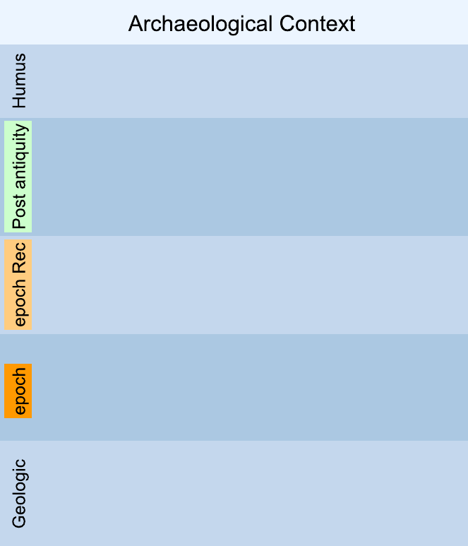
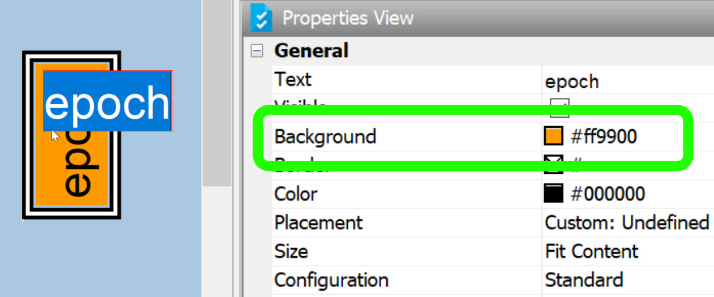

Draw the Extended Matrix in yEd
===============================

.. _draw_the_matrix:

.. note::

   This how-to is adapted from *Exercise 2 — Draw an Extended Matrix* in the
   Reconstructive Archaeology handbook. The reference dataset folder is
   ``M2E``.

.. note::

   **Prerequisite**: the Extended Matrix palette must be installed in
   yEd before you can draw the matrix. See
   :doc:`/mini_tutorials/setup_yed_palette` for the one-time setup.

In this exercise we will draw the stratigraphic units inside an Extended
Matrix using yEd and the EM palette. By the end you will have a small
``.graphml`` file ready to feed into the downstream tools of the EM
ecosystem (typically EM Tools in Blender).

Prerequisites
-------------

* yEd Graph Editor installed (free download from yWorks).
* The Extended Matrix palette for yEd installed
  (*menu Edit → Manage Palette → Import Section*; a short walkthrough is
  available on the
  `EM YouTube channel <https://youtu.be/M3Rwu9qS4P0?t=2460>`_).
* The workspace folder of your project prepared — see
  :doc:`em_workspace_preparation`.

Step 1: prepare the canvas
--------------------------

By means of *drag & drop* you take from the EM template (visible in the
right side of the yEd window) a **canvas** — a blue-coloured swimlane on
which the matrix will be written — and add it to the workspace.

   Empty Extended Matrix canvas inside yEd (these objects in yEd are
   called *swimlanes*).

Rename the top of the canvas (its *default* label is ``Archaeological
Context``) with the name of the context under study.

The canvas comes pre-populated with a number of preset epochs. Rename them
as needed. For each epoch you intend to reconstruct, add *immediately
above* the corresponding observational epoch a **reconstructive epoch**:
its name should match the observational one with the suffix ``rec``
appended — for example ``1st century AD`` → ``1st century AD rec``.

Each epoch has a reference colour, set by double-clicking the epoch name
and selecting a value in the *Properties View* panel at the bottom right.

   Procedure for changing the colour of an epoch.

For the formal definition of the canvas and its components, see :doc:`canvas`.

Step 2: insert stratigraphic units
----------------------------------

At this point you can begin to insert the stratigraphic units (US) within
the canvas. The procedure here again is *drag & drop* from the EM
template. The symbol of a US is a white rectangle with a unique number
inside (the US number).

Once a new US node has been inserted into the canvas, perform the
following operations:

1. **Rename the US** by double-clicking on the node name.
2. **Edit the description** in the *Properties View* panel at the bottom
   right. The description must be short, functional to identify the
   quality or function of the element.
3. **Connect the US** with other existing units (if there are any)
   through an *arc* — a line with a terminal arrow connecting two nodes.
   Pre-select the arc type in the template by double-clicking it; among
   the available types, choose the continuous-line arc with a terminal
   arrow.

   Linking arcs between nodes. The continuous-line arc with terminal
   arrow is pre-selected here.

.. important::

   By convention, the arrow always points to the older element (arrow
   pointing from the recent toward the past, i.e. top to bottom).

For the full vocabulary of node types see :doc:`stratigraphic_nodes` and
:doc:`auxiliary_stratigraphic_nodes`; for arcs and their semantics see
:doc:`connectors`.

Step 3: refine the matrix
-------------------------

If you have placed a US in the wrong epoch, you can select it and move it
to another epoch by **holding down SHIFT** throughout the whole drag, and
releasing the key only after the node has been dropped at its new
position.

Where you can estimate the *life-continuity* of a US — i.e. the unit
remained in use across several epochs — pick a *continuity* node from the
template, place it in the end-of-life epoch, and connect it to the
respective US.

Step 4: save the GraphML file
-----------------------------

Once several US nodes are linked together, you have your first Extended
Matrix. Save the file in yEd's default ``GraphML`` format inside the
``EM`` subfolder of your project workspace — the same folder where the
collected sources live.

This ``.graphml`` file is the input you will feed to the downstream tools
of the EM ecosystem. The typical next step is the
`EM Setup panel in EM Tools (Blender) <https://docs.extendedmatrix.org/projects/EM-tools/en/1.5/panels/em_setup.html>`_,
which loads the matrix and exposes the stratigraphic units for 3D modelling.

See also
--------

* :doc:`em_workspace_preparation` — the folder layout the ``.graphml``
  file is expected to live in.
* :doc:`canvas`, :doc:`stratigraphic_nodes`, :doc:`connectors` — the
  formal definitions behind every element you have just drawn.
* `Build the stratigraphic proxies in Blender <https://docs.extendedmatrix.org/projects/EM-tools/en/1.5/tutorials/build-proxies.html>`_
  — what to do, in EM Tools, once the matrix is drawn.
