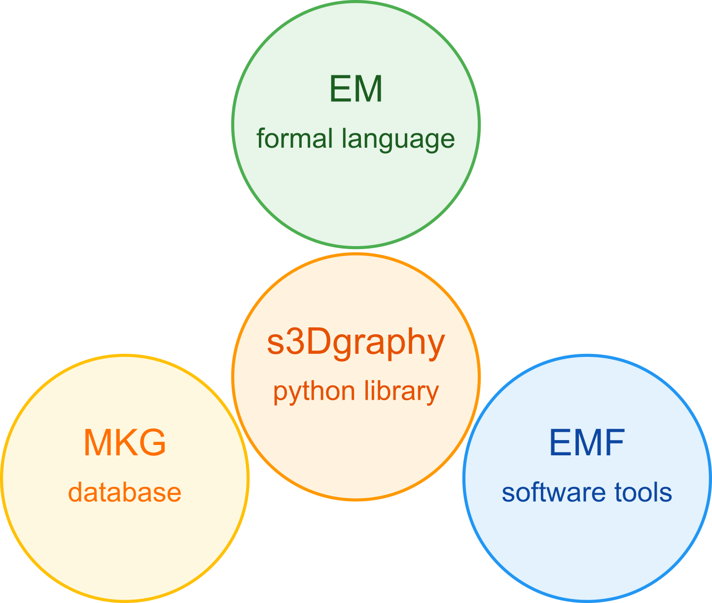

Extended Matrix documentation
=============================

**Extended Matrix** is a formal language with which to document stratigraphy and virtual reconstruction processes. It is intended to be used by archaeologists and heritage specialists to keep track in a robust way of their scientific activities. The EM allows to record the sources used and the processes of analysis and synthesis that have led from scientific evidence to interpretation and reconstruction. It organises 3D archaeological record so that the 3D modelling steps are smoother, transparent and scientifically complete. Its development is leaded by E. Demetrescu at CNR-ISPC (Rome, former CNR-ITABC). EM is at its 1.4 version (a 1.5 version is currently under development).

Extended Matrix structure
-------------------------

The diagram shows the essential structure of Extended Matrix through its core components.

   
   *Core components of Extended Matrix: Language, Framework and Knowledge Graph.*

At the top is the Extended Matrix Language, which provides the formal notation system; the Extended Matrix Framework, which includes all necessary software tools; and the Multidimensional Knowledge Graph, which serves as the underlying graph database structure. These components work together to provide a comprehensive system for archaeological data management and interpretation. Their interconnection is ensured by the s3Dgraphy library (in the middle) that offers tools and rules to coherently read, write, manage, and convert the knowledge graph behind the EM.

.. note::

   This documentation is related to a EM 1.5 development version: please pay attention that modifications may occur before releasing the final version.

.. toctree::
   :maxdepth: 2
   :caption: How to start

   learn_EM
   usage

.. toctree::
   :maxdepth: 2
   :caption: Formal Language

   canvas
   nodes_intro
   stratigraphic_nodes
   auxiliary_stratigraphic_nodes
   activity
   paradata_nodes
   qualia
   paradata_group
   connectors
   alternate_hypotheses
   data_funnel
   utils

.. toctree::
   :maxdepth: 2
   :caption: Theoretical Aspects:

   stratigraphic_approach
