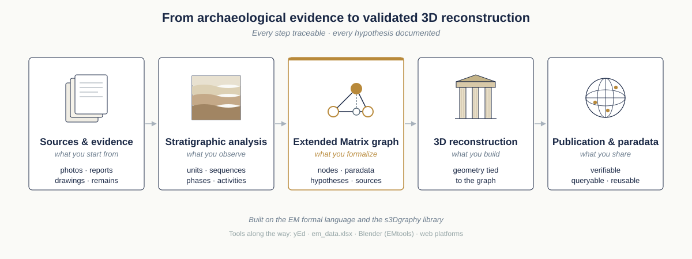

Extended Matrix documentation
=============================

**Extended Matrix** is a formal language with which to document stratigraphy and virtual reconstruction processes. It is intended to be used by archaeologists and heritage specialists to keep track in a robust way of their scientific activities. The EM allows to record the sources used and the processes of analysis and synthesis that have led from scientific evidence to interpretation and reconstruction. It organises 3D archaeological record so that the 3D modelling steps are smoother, transparent and scientifically complete. Its development is leaded by E. Demetrescu at CNR-ISPC (Rome, former CNR-ITABC). EM is at its 1.4 version (a 1.5 version is currently under development).

From sources to validated reconstruction
----------------------------------------

The Extended Matrix is the connective tissue between five well-known moments of the archaeological reconstruction process — and what makes each step traceable to the next.

   *The Extended Matrix workflow at a glance: from the evidence you collect to a reconstruction that other researchers can verify, query and reuse.*

You start with **sources and evidence** — photos, reports, drawings, the ruin itself. From these you carry out a **stratigraphic analysis**, identifying units, sequences, phases and activities. The **Extended Matrix graph** is where this analysis becomes formal: typed nodes for stratigraphic units, sources, paradata and hypotheses, connected by arcs with explicit semantic meaning. The graph then guides the **3D reconstruction**, where geometry is tied unit-by-unit to the graph nodes that justify it. The final step is **publication and paradata**: a reconstruction that other researchers can open and interrogate, because every interpretive choice is recorded in the graph and travels with the model.

The remainder of this manual walks through each of these moments in detail: how to learn the formal language, how to organise a project, and how each kind of node and connector works.

.. tip::

   If this is your very first contact with EM, jump to :doc:`learn_EM` for a guided tour calibrated to four different starting points (humanist, archaeologist with 3D skills, 3D modeller, and developer).

Components behind the workflow
------------------------------

The workflow above is supported by three core components — a formal language, a software framework, and a multidimensional knowledge graph — held together by the ``s3Dgraphy`` library.

.. figure:: img/EM_schema_general.png
   :width: 400px
   :align: center

   *Core components of Extended Matrix: Language, Framework and Knowledge Graph.*

At the top is the Extended Matrix Language, which provides the formal notation system; the Extended Matrix Framework, which includes all necessary software tools; and the Multidimensional Knowledge Graph, which serves as the underlying graph database structure. These components work together to provide a comprehensive system for archaeological data management and interpretation. Their interconnection is ensured by the s3Dgraphy library (in the middle) that offers tools and rules to coherently read, write, manage, and convert the knowledge graph behind the EM.

Extended Matrix and s3dgraphy: two complementary layers
--------------------------------------------------------

A common source of confusion is the relationship between **Extended Matrix (EM)** and **s3dgraphy**. They are not the same thing — they operate at different levels and serve different purposes, but they are deeply intertwined.

**Extended Matrix** is a *formal visual language*. Like a musical score or an architectural drawing, it is designed to be read, written, and reasoned about by human beings — archaeologists, heritage specialists, and researchers. EM defines a typed vocabulary of nodes (stratigraphic units, sources, interpretation nodes, paradata) and a set of connecting arcs with precise semantic meanings. This notation can be drawn on paper, edited in a graph editor such as yEd, or produced by AI-assisted extraction workflows. Its strength is human legibility: a trained specialist can look at an EM diagram and immediately understand the stratigraphic sequence, the sources behind each unit, and the interpretive steps that led to a reconstruction.

**s3dgraphy** is the *computational implementation* of EM as a property knowledge graph. It is a Python library that encodes the same knowledge in a machine-processable format — primarily GraphML and JSON — and provides tools to create, read, modify, validate, query, and convert EM graphs programmatically. s3dgraphy is what allows EM data to flow between tools (yEd, Blender, web platforms) and to be processed at scale by software pipelines.

The relationship can be summarised as follows:

- EM defines *what* the entities are and *what* the relationships mean — it is the schema and the notation.
- s3dgraphy defines *how* those entities are represented computationally and *how* the data is managed, stored, and exchanged.

In practical terms: an archaeologist authors or reviews a stratigraphic sequence using the EM visual language; s3dgraphy is the library that reads and writes the underlying graph file, enforces the EM data model, and makes the data available to the rest of the Extended Matrix Framework (EMtools for Blender, web visualisation platforms, AI extraction pipelines).

.. note::

   If you are working with the visual notation — drawing nodes, reading diagrams, understanding stratigraphic logic — you are working with **Extended Matrix**. If you are writing Python code to process, import, or export graph data, you are working with **s3dgraphy**.

.. note::

   This documentation is related to a EM 1.5 development version: please pay attention that modifications may occur before releasing the final version.

.. toctree::
   :maxdepth: 2
   :caption: How to start

   learn_EM
   usage
   project_organization

.. toctree::
   :maxdepth: 2
   :caption: Formal Language

   canvas
   nodes_intro
   stratigraphic_nodes
   auxiliary_stratigraphic_nodes
   activity
   paradata_nodes
   qualia
   source_node
   extractor_nodes
   paradata_group
   connectors
   alternate_hypotheses
   data_funnel
   utils

.. toctree::
   :maxdepth: 2
   :caption: Theoretical Aspects:

   stratigraphic_approach
   knowledge_tree

.. toctree::
   :maxdepth: 2
   
