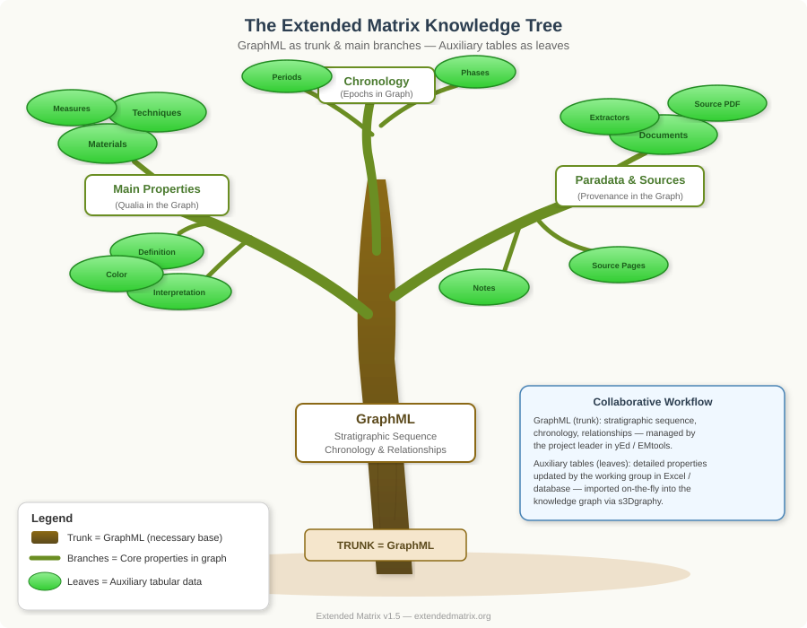
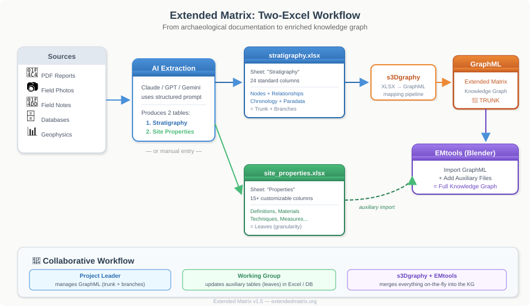

The Knowledge Tree: GraphML and Auxiliary Data
================================================

.. contents::
   :local:
   :depth: 2

The Tree Metaphor
------------------

The Extended Matrix knowledge system can be understood through the metaphor of a tree:

- The **trunk** is the GraphML file: it defines the stratigraphic sequence, the chronological scaffolding, and the fundamental relationships between units. It is the necessary base upon which everything else grows.

- The **main branches** are the core properties already embedded in the graph: node types (US, USVs, USVn, SF, VSF, USD, etc.), stratigraphic relationships (overlies, cuts, fills, abuts, bonds, equals), and the chronological framework (periods, phases, subphases with their temporal boundaries). These are the *qualia* that are intrinsic to the matrix structure.

- The **leaves** are the detailed, granular data brought in through auxiliary tabular files: definitions, interpretations, materials, construction techniques, measurements, conservation states, and all those properties that give richness and depth to each stratigraphic unit. These are the data that benefit most from being managed in spreadsheets or databases by the working group.

   The Extended Matrix Knowledge Tree: GraphML as trunk and main branches, auxiliary tabular data as leaves.

Why Two Separate Systems?
--------------------------

The separation between graph (trunk) and tables (leaves) is not a limitation but a deliberate architectural choice that enables:

**1. Collaborative work with different tools**

The GraphML is best managed by the project leader using graph editors (yEd) or through AI-assisted extraction and EMtools. It requires a specific understanding of stratigraphic logic and the Extended Matrix formal language.

The auxiliary tables, on the other hand, can be maintained by any team member using familiar tools: Excel, LibreOffice Calc, Google Sheets, or archaeological database systems like pyArchInit. No knowledge of graph theory or the EM formalism is needed to fill in a column of building techniques or material descriptions.

**2. Different update rhythms**

The stratigraphic sequence tends to stabilize relatively early in a project: once the relationships between units are established, they rarely change. The graph is edited infrequently but with great care.

Properties and detailed descriptions, conversely, are continuously updated as analysis progresses: new laboratory results arrive, interpretations evolve, measurements are refined. Keeping this data in tabular form means it can be updated quickly without touching the graph structure.

**3. Best of both worlds**

We do not want to abolish the tabular format by forcing everything into the knowledge graph, nor do we want to reduce the graph to a flat table. Instead:

- The **graph** provides what tables cannot: structural relationships, temporal ordering, provenance chains, and the ability to navigate the stratigraphic sequence as a connected network.
- The **tables** provide what graphs handle less elegantly: dense, columnar data that is easy to sort, filter, search, and bulk-edit.

Thanks to the s3Dgraphy library, EMtools, and other compatible tools, these two worlds are merged **on-the-fly** into a unified knowledge graph. The import is non-destructive: auxiliary data enriches existing nodes without altering the graph structure.

The Two-Excel Workflow
-----------------------

When creating an Extended Matrix from documentary sources (whether manually or with AI assistance), the recommended workflow produces two standardized Excel files:

   The two-Excel workflow: from sources through AI extraction to the enriched knowledge graph.

**Excel 1: stratigraphy.xlsx** (the trunk and main branches)
   Contains the 24 standard columns that generate the GraphML: node IDs, types, descriptions, chronological data (period, phase, subphase with temporal boundaries), all stratigraphic relationships (overlies, cuts, fills, abuts, bonds, equals), and paradata (extractor, source document).

   This file is processed by s3Dgraphy's ``MappedXLSXImporter`` to produce a valid Extended Matrix GraphML file.

**Excel 2: site_properties.xlsx** (the leaves)
   Contains site-specific properties: definitions, interpretations, building techniques, materials, measurements, conservation states, and any project-specific attributes. The columns are customizable per project.

   This file is imported as an **auxiliary file** in EMtools, where it enriches the existing graph nodes with detailed attributes.

Data Flow
----------

The complete data flow from source to knowledge graph follows this path::

   Archaeological Sources (PDF, photos, field notes, databases)
          │
          ▼
   AI Extraction or Manual Entry
          │
          ├──────────────────────────┐
          ▼                          ▼
   stratigraphy.xlsx          site_properties.xlsx
   (24 standard columns)      (15+ custom columns)
          │                          │
          ▼                          │
   s3Dgraphy MappedXLSXImporter     │
          │                          │
          ▼                          │
   GraphML (Extended Matrix)         │
          │                          │
          ▼                          ▼
   EMtools (Blender) ◄──── Auxiliary File Import
          │
          ▼
   Enriched Knowledge Graph
   (trunk + branches + leaves)

Creating the GraphML
---------------------

The GraphML (the trunk) can be created through several methods:

1. **Manual creation in yEd**: The traditional approach using the yEd Graph Editor with the Extended Matrix palette. Best for small-medium projects where the stratigrapher directly builds the graph. See the `yEd workflow guide <https://docs.extendedmatrix.org/projects/EM-tools/en/1.5.0/creating_em.html#from-graphml-yed>`_.

2. **From Excel via s3Dgraphy**: Using the standardized ``template_stratigraphy.xlsx`` and the mapping pipeline. Ideal for AI-assisted extraction. See the `Excel import guide <https://docs.extendedmatrix.org/projects/EM-tools/en/1.5.0/creating_em.html#from-excel-standard-stratigraphy>`_.

3. **From pyArchInit**: The pyArchInit archaeological information system can export GraphML files in Extended Matrix format directly. See the `pyArchInit documentation <https://pyarchinit.readthedocs.io/it/latest/novit%C3%A0.html#herris-matrix-per-extended-matrix-tool>`_.

Enriching with Auxiliary Data
------------------------------

Once the GraphML exists, it can be enriched through auxiliary files:

- **EMdb Excel files**: Tabular data with custom column mappings (site properties, detailed descriptions, laboratory analyses)
- **pyArchInit databases**: SQLite databases imported as auxiliary sources, adding properties to existing graph nodes
- **DosCo folders**: Documentary source collections linked to stratigraphic units
- **Source lists**: Excel files with structured source descriptions

Each auxiliary file type uses a specific mapping that defines how tabular columns translate to graph node properties. The s3Dgraphy mapping system (``MappingRegistry``) supports custom mapping directories, enabling project-specific data schemas.

.. seealso::

   - :doc:`qualia` — The property taxonomy in Extended Matrix
   - :doc:`paradata_nodes` — How data provenance is tracked
   - :doc:`data_funnel` — The three-level data hierarchy
   - `Creating EM from Different Sources (EMtools docs) <https://docs.extendedmatrix.org/projects/EM-tools/en/1.5.0/creating_em.html>`_
