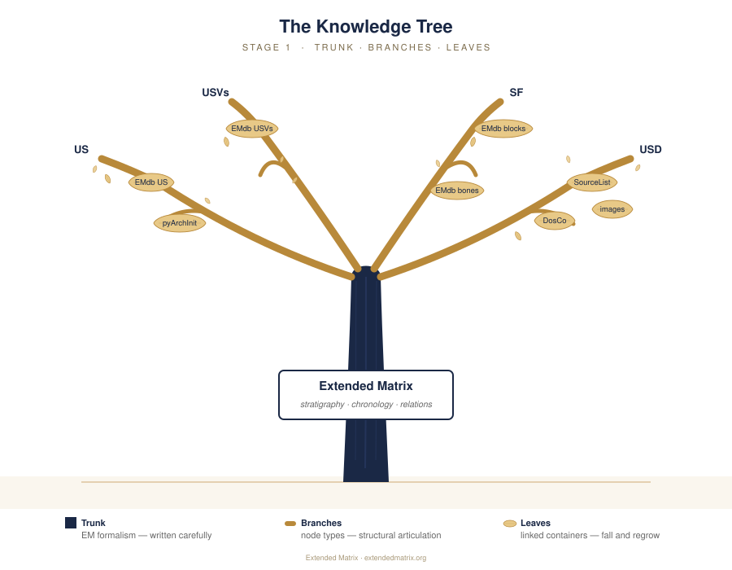
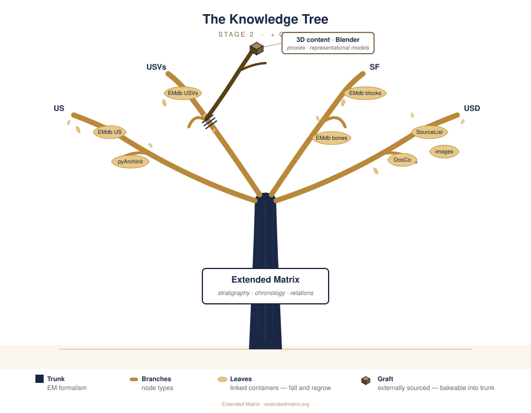
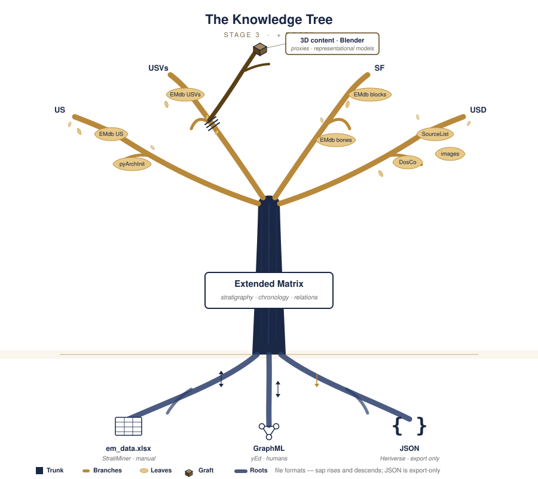

The Knowledge Tree
===================

.. contents::
   :local:
   :depth: 2

A living metaphor
------------------

The Extended Matrix is best understood through the metaphor of a living tree.
The metaphor is *anthropocentric*: it organises the system around how a human
researcher reads, writes, and grows an Extended Matrix over time. It is built
up here in three additive stages — each figure is the previous one with a new
layer added. Same silhouette, same palette, more detail.

Throughout the chapter, *sap* stands for the data that flows through the tree:
it rises from the roots when you load a file, courses through the trunk while
EMtools and s3Dgraphy operate on it, reaches the leaves when auxiliary tables
are linked, and descends back to the roots when you save. The tree is alive
because the data flows in both directions.

Stage 1 — Trunk, branches, leaves
----------------------------------

   Stage 1 — the basic anatomy of the Extended Matrix as a knowledge tree.

The **trunk** is the Extended Matrix itself: the formalism, the stratigraphic
structure, the chronology. Its fibres are the things that hold the matrix
together — the stratigraphic relationships of *overlies*, *cuts*, *fills*,
*abuts*, *bonds*, *equals*, and the temporal scaffolding of periods, phases,
and subphases. The trunk is what makes a matrix recognisable as an Extended
Matrix, and it is the part that is written most carefully and changed most
infrequently.

The **branches** are the node types that articulate from the trunk: ``US``,
``USVs``, ``USVn``, ``SF``, ``USD``, ``VSF``, and the others described in
:doc:`nodes_intro`. They are the structural arms of the formalism — the places
where data finds a meaningful home. A property has to attach somewhere; the
branches are the somewheres.

The **leaves** are auxiliary data hanging from specific branches: an *EMdb
catalog of stratigraphic units* attaches to the ``US`` branch; a *catalog of
architectural blocks* and a *catalog of bone remains* attach to the ``SF``
branch; *source lists*, the ``DosCo`` documentary folder, and *image
libraries* attach to the ``USD`` branch. A single auxiliary system like
``EMdb`` commonly produces several leaves on different branches at once —
one per category of material — each attached where it makes sense.

Leaves are not part of the trunk's wood: they are *linked*. They can fall and
grow back. They live in their own containers (Excel spreadsheets,
archaeological databases like ``pyArchInit``, structured source lists,
``DosCo`` folders, image libraries) and are loaded into the graph each time
without being baked into the GraphML, unless you explicitly ask for it.

This is the deepest invariant of the whole metaphor: the trunk is *written*,
the branches are *structural*, the leaves are *appoggiate* — placed lightly,
available, replaceable.

Stage 2 — Grafts
-----------------

   Stage 2 — Stage 1 plus the grafts: data integrated from outside the
   formalism.

Some data cannot live in a graph at all. Three-dimensional content authored in
Blender — proxies of stratigraphic units, representational models, virtual
surfaces with their geometry — is not representable as a node-and-edge
structure in any sensible way. Yet it is essential to a complete Extended
Matrix project, because the graph and the 3D world have to speak to each
other.

Such contents enter the tree as **grafts**: they are joined onto a branch
(typically the relevant node-type branch — a 3D proxy of a ``US`` is grafted
to the ``US`` branch) and become part of the tree once integrated. Grafts
differ from leaves in two important ways:

- Grafts are **not container-resident** in the same loose sense as leaves: a
  graft is *part of the tree itself* once it has taken root, even though its
  underlying content also lives in a Blender ``.blend`` file on disk.

- Grafts can be **baked**. When you decide that a Blender proxy and its EM
  node are now permanently and canonically associated, you can formalise that
  association into the trunk so deeply that they become indistinguishable from
  native fibre. Leaves never bake; grafts can.

The grafting metaphor is not casual. A graft is something the gardener
chooses, joins, and tends. It carries content the trunk could not produce on
its own, and it earns its place in the tree by being deliberately attached.

Stage 3 — Roots
----------------

   Stage 3 — Stage 2 plus the roots: the file formats from which the Extended
   Matrix draws its sap.

The trunk is not a single file. The Extended Matrix is one entity expressed
in several **roots** — the file formats that the tree both draws from and
deposits back into:

- ``em_data.xlsx`` — the unified workbook with five sheets (``Units``,
  ``Epochs``, ``Claims``, ``Authors``, ``Documents``), produced by humans
  manually or by AI through the StratiMiner prompt. It is the root through
  which the matrix can be planted from scratch from documentary sources, or
  grown by patient hand from existing tabular data. The workbook's shape,
  authoring conventions (multi-valued cells, hierarchical paths, kind
  prefixes), and per-concept column contracts are documented on the
  dedicated :doc:`em_data` page — that is the canonical reference both
  for human authors and for the StratiMiner AI extractor.

- ``GraphML`` — the human-readable root, opened in yEd Graph Editor with the
  Extended Matrix palette. This is where humans see the matrix as a network
  they can read, edit, and reason about visually.

- ``JSON`` for Heriverse — the export root that feeds the public Heriverse
  environment, where the matrix becomes a navigable spatial-temporal
  experience.

The roots are bidirectional where round-trip makes sense. Sap rises when you
load (``em_data.xlsx`` → in-memory ``s3D Graph``; ``GraphML`` → ``s3D
Graph``), and it descends when you save (``s3D Graph`` → ``em_data.xlsx``;
``s3D Graph`` → ``GraphML``; ``s3D Graph`` → ``JSON``). The in-memory ``s3D
Graph`` is the living wood of the trunk: the moment-by-moment state of the
tree, machine-actionable, the pivot through which all roots communicate.

This is what frees the modern Extended Matrix from any single canonical file.
You can enter through whichever root suits your work — AI-driven extraction
through ``em_data.xlsx``, manual stratigraphy through ``GraphML``/yEd,
archaeological fieldwork through ``pyArchInit`` — and the tree will still be
the same tree.

Two orthogonal dimensions
--------------------------

The figure now describes two things at once, and it is worth keeping them
distinct in your mind:

1. **Anthropocentric integration** (above ground): how a human researcher
   composes a complete Extended Matrix project — the trunk of the formalism,
   the branches of node types, the leaves of auxiliary data, the grafts of 3D
   content. This is *what is in the matrix*.

2. **Representation and exchange** (below ground): how the matrix is
   serialised and shared — the roots of ``em_data.xlsx``, ``GraphML``,
   ``JSON``. This is *how the matrix moves between formats and between
   people*.

These dimensions are independent. You can change which roots you use without
changing what is in the tree; you can graft new content without changing how
the tree is serialised. Keeping them visually distinct (above the ground line
vs. below it) is a way of keeping them distinct in practice.

Working with leaves: auxiliary data
------------------------------------

Auxiliary data is the everyday material that sustains a project: site
descriptions, building techniques, conservation states, laboratory analyses,
source bibliographies. It is best maintained in the tools that suit each kind
of data — spreadsheets for tabular things, archaeological databases for
excavation records, structured Excel files for source lists.

The Extended Matrix loads these as auxiliary files and links them as leaves
to the appropriate branches. Each auxiliary type uses a specific *mapping*
that defines how columns translate to graph node properties. The s3Dgraphy
``MappingRegistry`` ships three default mappings — ``pyarchinit``, ``emdb``,
``generic`` — and supports custom project-specific mapping directories.

The principle is **non-destructive enrichment**: auxiliary data adds
attributes to existing nodes; it does not alter the trunk's structure. And
because leaves are linked (not baked), they can be refreshed at any time by
reloading the source — the leaves "fall and grow back" as the data evolves.

If a particular auxiliary becomes stable enough that you want it to be
permanently part of the matrix, you can bake it: explicitly migrating the
linked properties into the GraphML so they persist across loads.

Entering the tree: a practical summary
---------------------------------------

A reader who has followed the metaphor this far will want to know how to
actually start a project. The Extended Matrix can be entered through any of
its roots; the choice depends on the nature of the source material and on the
team:

- **Through** ``yEd`` **with the EM palette** — manual, traditional, ideal for
  small-to-medium projects where the stratigrapher builds the graph directly.
  See the
  `yEd workflow guide <https://docs.extendedmatrix.org/projects/EM-tools/en/1.5.0/creating_em.html#from-graphml-yed>`_.

- **Through** ``em_data.xlsx`` **via StratiMiner or by hand** — the unified
  workbook approach. AI extraction through the StratiMiner prompt populates
  the workbook from PDFs and field notes; alternatively a human team can fill
  it manually from existing tabular data. The s3Dgraphy
  ``UnifiedXLSXImporter`` parses the workbook into an in-memory ``s3D Graph``
  and from there into ``GraphML``. The workbook itself — sheets, columns,
  authoring conventions, per-concept contracts — is documented on
  :doc:`em_data`, which is the contract that both human authors and
  StratiMiner are held to. See also the
  `Excel import guide <https://docs.extendedmatrix.org/projects/EM-tools/en/1.5.0/creating_em.html#from-excel-standard-stratigraphy>`_
  for the operational details on the EM Tools side.

- **Through** ``pyArchInit`` — the archaeological information system can
  export GraphML files in Extended Matrix format directly, bringing fieldwork
  records into the tree as a starting point. See the
  `pyArchInit documentation <https://pyarchinit.readthedocs.io/it/latest/novit%C3%A0.html#herris-matrix-per-extended-matrix-tool>`_.

Each entry point produces (or contributes to) the same trunk. From there you
graft your 3D content, link your leaves, and let the tree grow.

.. seealso::

   - :doc:`em_data` — the canonical reference for the ``em_data.xlsx``
     workbook (sheets, conventions, per-concept column contracts)
   - :doc:`qualia` — the property taxonomy that lives along the branches
   - :doc:`paradata_nodes` — how data provenance is recorded along the trunk
   - :doc:`data_funnel` — the three-level data hierarchy
   - `Creating EM from Different Sources (EMtools docs) <https://docs.extendedmatrix.org/projects/EM-tools/en/1.5.0/creating_em.html>`_
