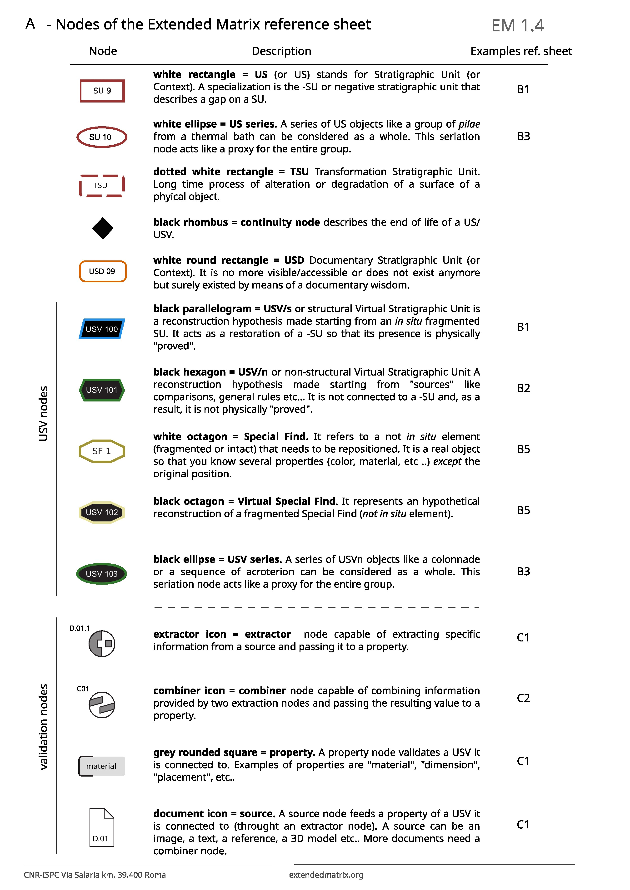

Nodes of the Extended Matrix (short intro):
===========================================

EM uses two sets of standardized nodes: Stratigraphic and validation nodes (see Fig. 1). The US nodes represent both real and virtual stratigraphic units (according to a specific typology) while the validation nodes express the scientific process behind them. These nodes are connected each other by arcs in the same way that it happens with the archaeological Matrix of Harris.

Extended Matrix nodes include all the graphic elements on the two-dimensional canvas except for the connecting lines between them, which are called arcs or connectors.

Nodes are divided into three major families: stratigraphic units, sources, and interpretation and reasoning nodes.
