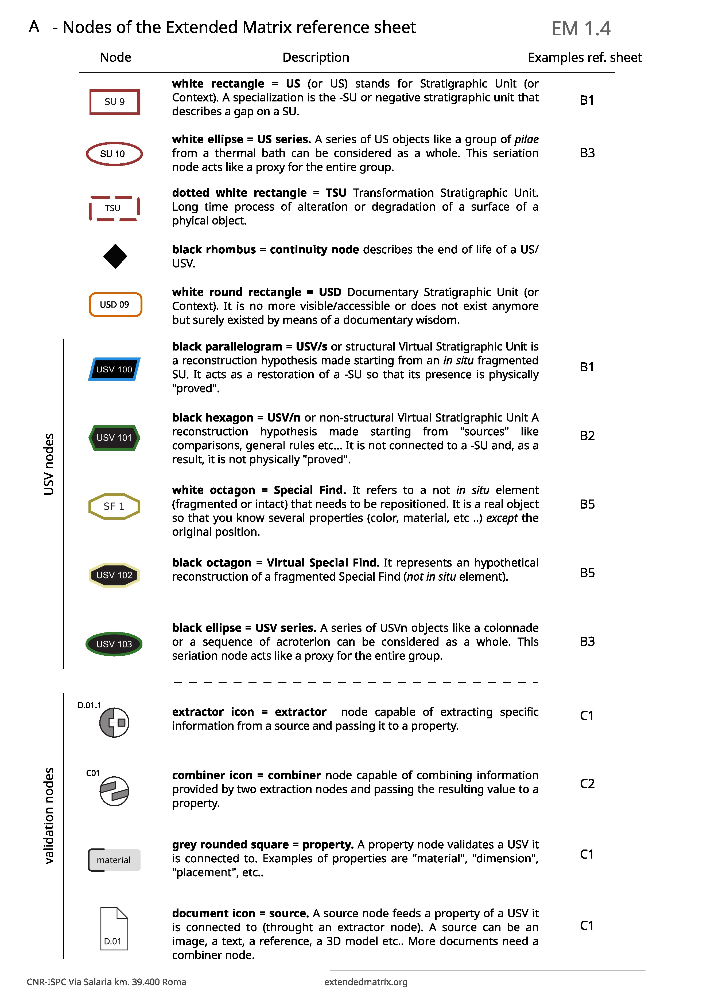

Nodes overview
==============

.. _nodes_intro:

EM uses two sets of standardized nodes: stratigraphic and validation nodes (see Fig. 1). The US nodes represent both real and virtual stratigraphic units (according to a specific typology), while the validation nodes express the scientific process behind them. These nodes are connected to each other by arcs, in the same way as in the archaeological Matrix of Harris.

.. note::

    For a clearer idea of `why using stratigraphy is not archaeology-centred but has a wider impact in the domain of Cultural Heritage <stratigraphic_approach.html>`_, see the dedicated section.

Extended Matrix nodes include all the graphic elements on the two-dimensional canvas except for the connecting lines between them, which are called arcs or connectors.

Nodes are divided into three major families: stratigraphic units, sources, and interpretation and reasoning nodes.

Organising your project data
----------------------------

Before authoring even the first node, it helps to know that an EM graph never lives alone — it is always at the centre of a small, conventional folder structure. Knowing the shape of that structure now makes the next pages much easier to follow.

A minimal EM project on disk looks like this:

.. code-block:: text

   my_project/
   ├── my_project.graphml          # the EM graph (yEd / em_data.xlsx output)
   ├── em_data.xlsx                # optional tabular authoring (5-sheet template)
   ├── source_list.xlsx            # bibliography & source registry
   └── DosCo/                      # Documentation Source Collection
       ├── photographs/
       ├── reports/
       ├── drawings/
       └── analyses/

The four pieces play complementary roles:

.. list-table::
   :header-rows: 1
   :widths: 22 78

   * - Element
     - Purpose
   * - **GraphML file** (``.graphml``)
     - The EM graph itself: nodes (units, sources, paradata) and arcs. The trunk of the knowledge tree.
   * - **em_data.xlsx**
     - Optional spreadsheet companion that carries the *leaves* — descriptions, properties, dates, materials — and can also generate the GraphML in batch via the unified importer.
   * - **source_list.xlsx**
     - Registry of every source referenced by the graph (id, title, year, file path, licence). The single point of truth for citations.
   * - **DosCo folder**
     - Where the actual source files live: photographs, reports, drawings, analyses. Document nodes in the graph point here by relative path.

The convention matters because every EM-aware tool (yEd, EM Tools, Heriverse, the AI extractors) expects to find these four pieces side by side. Keeping them in one self-contained folder also makes the project easy to share, archive, and cite as a unit.

.. seealso::

   The full project-organisation guide — including site code conventions, multi-site layouts, and integration with EM Tools — is in :doc:`project_organization`. *The Knowledge Tree* metaphor (graph as trunk, xlsx as leaves) is unpacked in :doc:`knowledge_tree`.
