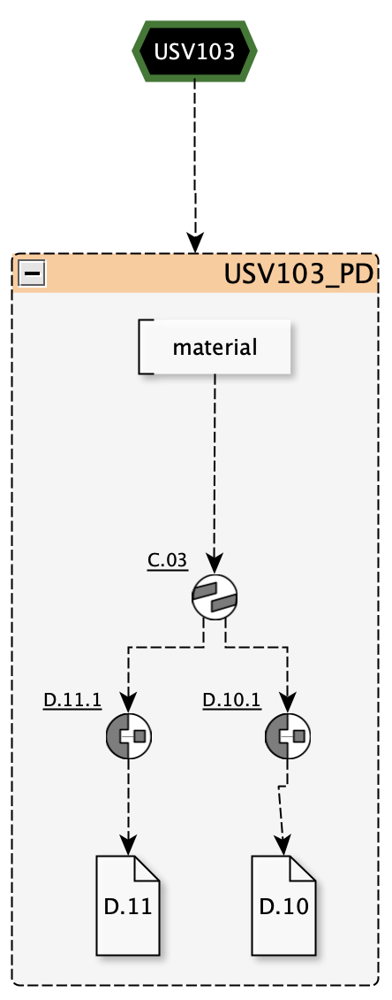
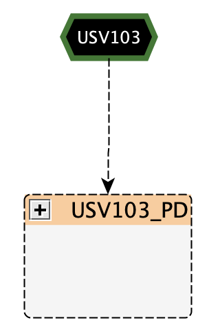

Paradata Nodes Group
====================

   *Example of a paradata group in the Extended Matrix, showing nodes grouped together (background color `#ffcc99`).*

**Paradata Group** is a specialized node group in the Extended Matrix that encapsulate all paradata related to a specific stratigraphic unit (see the Paradata nodes section). Paradata refers to metadata about the data—information that provides context on how data was collected, processed, and interpreted. Grouping paradata enhances the organization and readability of the matrix.

In the yED palette EM 1.5, paradata groups are visually distinguished by a text background color of `#ffcc99`. This consistent coloring helps users quickly identify paradata groups within the matrix.

An important feature of paradata groups is the ability to **collapse** them into a single node within yED. This functionality improves the readability of the matrix by reducing visual clutter when the detailed paradata information is not needed.

Collapsing Paradata Groups
--------------------------

Paradata groups can be collapsed into a single node to enhance the matrix's readability. This is particularly useful when dealing with complex matrices that contain extensive paradata for multiple stratigraphic units.

   
   *Paradata group collapsed into a single node for improved readability.*

Connecting Paradata Groups to Stratigraphic Units
-------------------------------------------------

A paradata group is directly connected to the stratigraphic unit it references. This direct connection ensures that all contextual information about the data collection and interpretation processes is readily accessible and associated with the correct stratigraphic unit.

Understanding Paradata Groups
-----------------------------

Paradata groups serve several important functions within the Extended Matrix:

- **Organization of Metadata**: By grouping all paradata related to a stratigraphic unit, users can easily access detailed information about the data's provenance, collection methods, and interpretative processes.

- **Improved Readability**: Collapsing paradata groups reduces visual clutter in the matrix, making it easier to focus on the primary stratigraphic data when needed.

- **Enhanced Data Transparency**: Paradata provides transparency about the data's background, increasing the reliability and credibility of the stratigraphic interpretations.

Components of a Paradata Group
------------------------------

A paradata group may include:

- **Data Sources**: References to documents, photographs, oral accounts, or other sources from which the data was derived.

- **Interpretative Processes**: Information about the methods and reasoning used to interpret the stratigraphic data.

- **Data Collection Methods**: Details about how the data was collected, including tools used, sampling techniques, and any relevant procedures.

Implementing Paradata Groups in the Extended Matrix
---------------------------------------------------

When adding paradata to the Extended Matrix:

1. **Create a Paradata Group**: Use the node grouping feature to encapsulate all paradata nodes related to a specific stratigraphic unit.

2. **Apply Visual Attributes**: Set the text background color to `#ffcc99` to visually distinguish the paradata group within the matrix.

3. **Connect to Stratigraphic Unit**: Directly link the paradata group to the stratigraphic unit it references to establish a clear association.

4. **Utilize Collapse Functionality**: In yED, collapse the paradata group into a single node when detailed paradata information is not required, enhancing the matrix's readability.

Conclusion
----------

Paradata groups are a valuable feature in the Extended Matrix, enabling archaeologists to organize and manage the metadata associated with their stratigraphic data effectively. By visually distinguishing these groups and allowing for collapsible nodes, the matrix becomes more user-friendly and accessible, facilitating deeper insights into the archaeological record.

