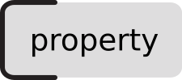
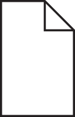
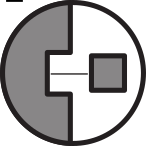

Paradata Nodes
=============

.. _paradatanodes:

Introduction
-----------

Paradata nodes (``ParadataNode``, also known as validation nodes) are a specialized set of nodes designed to express data provenance—documenting how we know what we know about stratigraphic units. These nodes form a "family" that works together to create a clear chain of evidence and interpretation.

.. admonition:: Example
   :class: example

   Consider a Roman wall visible inside a modern building's basement. A user needs to document various properties, each sitting at a different point along a gradient of certainty and evidence:

   **Direct Observation**
   * Surface ``material`` visible and touchable
   * Exposed ``height`` measurable with tape
   * Construction technique visible on surface

   **Instrumental Detection**
   * Wall ``thickness`` measured through georadar
   * Internal structure revealed by thermography
   * Foundation depth from archaeological probes

   **Documentary Evidence**
   * Original ``height`` suggested by historical descriptions
   * Previous restoration work from archival records
   * Past modifications from historical photographs

   **Comparative Analysis**
   * Construction period (``start_time``) inferred from technique
   * Original ``function`` based on similar structures
   * Architectural details reconstructed from parallels

   **Complete Hypothesis**
   * Full architectural reconstruction
   * Original appearance and decoration
   * Integration with surrounding structures

Each ``property`` can be documented with its own paradata chain, regardless of where it falls on this gradient. This flexible approach allows:

_ Documentation chains that reflect the real complexity of knowledge acquisition
- Multiple methods of determination for the same property
- Clear tracking of evidence strength and certainty levels
- Integration of physical evidence and interpretative reconstruction
- Unified treatment of study and reconstruction

The power of paradata nodes lies in their ability to model plastically around the phenomenon being studied or reconstructed, breaking down artificial barriers between observation and interpretation. A single stratigraphic unit might have properties documented through various means, each with its own evidence chain:

.. admonition:: Technical Tip
   :class: technical-tip

   The paradata chains adapt to each property's nature:
   * Direct measurements might have shorter, simpler chains
   * Reconstructed elements typically have more complex chains with multiple sources
   * Some properties might have parallel chains representing different interpretative approaches

Paradata Node types
-------------------

.. _propertynode:

Property Node (``PropertyNode``)
~~~~~~~~~~~~

A property node represents a specific characteristic or attribute of a stratigraphic unit. The name of a property corresponds to its type (e.g., :ref:`material <material_type>`, :ref:`height <height_qualia>`, :ref:`length <length_qualia>`).

.. note::
   For a complete taxonomy of property types and their relationships, please refer to the `Properties (Qualia) section of this documentation <https://docs.extendedmatrix.org/en/1.5.0dev/paradata_nodes.html>`_.

.. admonition:: Example
   :class: example

   For a column base, properties might include:
   ``material`` = marble; ``height`` = 45cm; ``style`` = Doric

.. admonition:: Technical Tip
   :class: technical-tip

   s3Dgraphy automatically generates unique identifiers by combining the ID of the connected stratigraphic unit with the property name (e.g., "USM100.height", "SF10.material").

.. _documentnode:

Document Node (``DocumentNode``)
~~~~~~~~~~~~

A document node represents primary sources that provide evidence about stratigraphic units.

.. note::
   For a complete taxonomy of document (source) types and their relationships, please refer to the `Document (Source) section of this documentation <https://docs.extendedmatrix.org/en/1.5.0dev/source_node.html>`_.

.. admonition:: Example
   :class: example

   Common document types include:
   * Excavation reports
   * Historical photographs
   * Ancient texts
   * Survey drawings

.. _extractornode:

Extractor Node (``ExtractorNode``)
~~~~~~~~~~~~~

An extractor node captures how researchers interpret information from source documents.

.. admonition:: Practical Example
   :class: example

   Let's examine how an extractor processes information from a historical source to establish a construction technique:

   **Context**: 
   A historical photograph from 1892 shows the remains of a Roman wall before modern restoration work.
   
   **Source Document (D.01)**
   - Type: Historical photograph
   - Date: 1892
   - Archive: State Archive of Rome
   - Description: Black and white photograph showing the eastern wall of the Roman villa

   **Extractor Analysis (D.01.01)**
   The extractor node documents the interpretive process:
   
   "The photograph shows a clear pattern of regular courses in the wall face. 
   Despite the grainy quality of the 19th-century photograph, the size and 
   arrangement of the elements are consistent with opus testaceum (Roman 
   brick facing technique). This is evidenced by:
   
   1. Regular horizontal coursing visible in the wall face
   2. Uniform size of individual elements suggesting standard Roman brick dimensions
   3. Characteristic pattern of headers and stretchers typical of 2nd century CE 
      opus testaceum
   4. Visible remains of mortar joints of approximately 1 finger width"

   **Resulting Property Node**
   - Property: construction_technique
   - Value: opus testaceum
   - Reliability: high
   - Supporting evidence: Photographic documentation showing characteristic 
     patterns of Roman brick construction technique

    This example demonstrates how an extractor transforms visual information from a historical photograph into a documented construction technique property, creating a clear chain of evidence from source to interpretation.

.. note::
   For a complete taxonomy of extracto (interpretation) types and their relationships, please refer to the `Extractor (Interpretation) section of this documentation <https://docs.extendedmatrix.org/en/1.5.0dev/extractor_nodes.html>`_.

.. admonition:: Example
   :class: example

   An archaeologist reading a 19th-century excavation report might note: "The description on page 10 clearly identifies this capital as being made of Pentelic marble, based on the crystalline structure described."

.. _combinernode:

Combiner Node (``CombinerNode``)
~~~~~~~~~~~~

A combiner node represents the synthesis of multiple interpretations to support a single conclusion.

.. admonition:: Example
   :class: example

   An archaeologist might combine:

   - A historical photograph showing column dimensions
   - An excavation report describing material
   - A comparative analysis of similar structures
  
   To establish comprehensive documentation of a column's properties.

Working Together: The Paradata Chain
---------------------------------

.. admonition:: Example
   :class: example

   Consider documenting a fragmentary lintel:

   1. **Physical Evidence**: Fragmentary lintel (SU003)
   2. **Source**: Historical photograph of Temple of Mars, Rome (D01)
   3. **Interpretation**: Analysis of decorative elements visible in photograph
   4. **Property**: Decoration style attribution

.. admonition:: Technical Tip
   :class: technical-tip

   The paradata chain follows the DIKW (Data-Information-Knowledge-Wisdom) hierarchy:
   * Data: Raw sources (Document Nodes)
   * Information: Interpreted sources (Extractor Nodes)
   * Knowledge: Combined interpretations (Combiner Nodes)
   * Wisdom: Applied understanding (Property Nodes)

Multiple Source Validation
------------------------

.. admonition:: Example
   :class: example

   Complex properties often require multiple sources:

   * Physical elements: Fragmentary lintel (SU003) atop two columns
   * Sources: Position measurements of both columns
   * Interpretation: Analysis of spatial relationships
   * Synthesis: Combined measurements determine total length
   * Property: Final length attribution

.. figure:: img/EM_Reference_CHART_C_a.jpg
   :width: 600
   :align: center
   :alt: Single source example
   :name: single_source_example

   Example of property validation using a single source

.. figure:: img/EM_Reference_CHART_C_b.jpg
   :width: 600
   :align: center
   :alt: Multiple sources example
   :name: multiple_sources_example

   Example of property validation using multiple sources

.. figure:: img/EM_Reference_CHART_C_graph.jpg
   :width: 600
   :align: center
   :alt: Paradata chain example
   :name: paradata_chain

   Example of complete paradata chain (Draft diagram - to be updated)

Name conventions
----------------

.. admonition:: Data Format
   :class: data-format

   Node naming conventions:
   * Document nodes: "D.01", "D.02", etc.
   * Extractor nodes: [Document ID].[sequence], e.g., "D.01.01"
   * Combiner nodes: "C.01", "C.02", etc.
   * Property nodes: same name as the property (height, material, etc..)

Best Practices
------------

1. **Documentation Chain Integrity**
   * Maintain clear links between all nodes in the chain
   * Document reasoning at each interpretation step
   * Preserve connection to original sources

2. **Multiple Source Handling**
   * Use combiner nodes when synthesizing multiple sources
   * Document conflicts or discrepancies between sources
   * Explain reasoning for preferring certain interpretations

3. **Property Documentation**
   * Link properties to supporting evidence
   * Document certainty levels
   * Note alternative interpretations when relevant

References
---------

The paradata chain concept is grounded in the DIKW (Data-Information-Knowledge-Wisdom) hierarchy:

* Ackoff, R. L. (1989). "From Data to Wisdom". Journal of Applied Systems Analysis, 16(1), pp. 3-9.

.. admonition:: Technical Note
   :class: technical-tip

   For details on implementing these concepts in s3Dgraphy and integration with other systems, please refer to the Technical Documentation section.