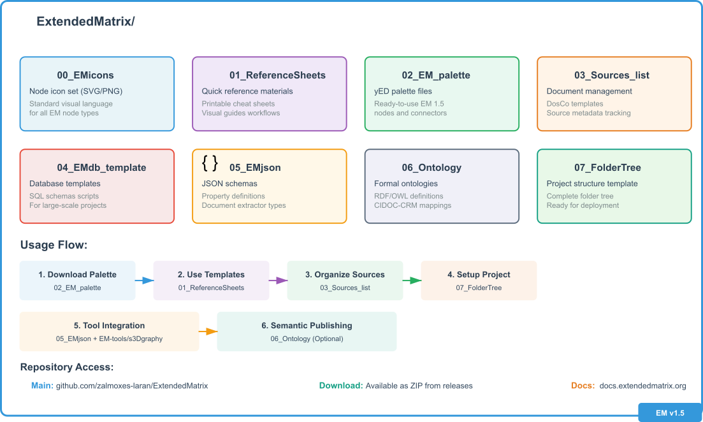
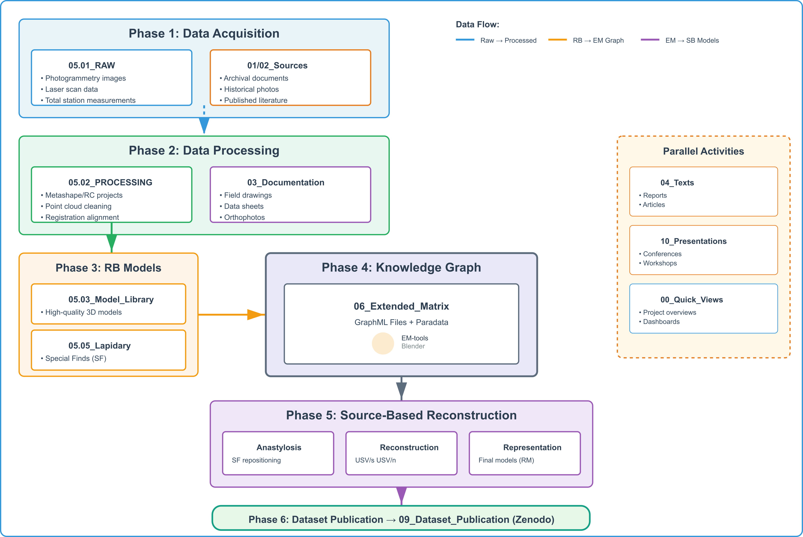

Project Organization and Workflow
==================================

.. _project_organization:

This section provides practical guidance for organizing Extended Matrix projects, from understanding available repository resources to setting up your working environment. The standardized structure presented here has been refined over 20 years of field application across diverse archaeological contexts.

.. note::
   The folder structure is language-agnostic (uses English naming) to facilitate international collaboration and long-term data preservation according to FAIR principles.

Extended Matrix Repository Resources
------------------------------------

The `Extended Matrix repository <https://github.com/zalmoxes-laran/ExtendedMatrix>`_ contains essential resources for working with the formal language. Understanding this structure helps you locate the right tools for each phase of your work.

   
   *Extended Matrix repository structure on GitHub*

Repository Contents
~~~~~~~~~~~~~~~~~~

**00_EMicons** - Node Icon Set
    * Standard SVG and PNG icons for all EM node types
    * Consistent visual language across platforms
    * Available formats: SVG (scalable), PNG (raster)
    * Usage: Documentation, presentations, custom tools

**01_ReferenceSheets** - Quick Reference Materials
    * Printable cheat sheets for EM syntax
    * Visual guides for node types and connectors
    * Workflow diagrams and decision trees
    * Ideal for field work and teaching

**02_ExtendedMatrix_palette** - yED Palette Files
    * Ready-to-use palettes for yED Graph Editor
    * Current version: EM 1.5
    * Includes all standard nodes and connectors
    * Auto-formatted with proper visual attributes

**03_Sources_list** - Document Management Templates
    * Excel templates for DosCo (Dossier Comparativo) organization
    * Structured fields for source metadata
    * Property validation tracking
    * Integration with document nodes

**04_EMdb_template** - Database Templates
    * Relational database schemas for EM data
    * SQL scripts for database initialization
    * Query templates for common operations
    * Useful for large-scale projects

**05_EMjson** - JSON Schemas and Configurations
    * Machine-readable definitions of EM structures
    * Property type definitions (qualia)
    * Document type taxonomies
    * Extractor type specifications
    * Used by s3Dgraphy library and EM-tools

**06_Ontology** - Formal Ontologies
    * RDF/OWL ontologies for semantic web integration
    * CIDOC-CRM mappings
    * SKOS vocabularies
    * Enables interoperability with other heritage systems

**07_FolderTree** - Standard Project Structure
    * Complete folder tree template for archaeological projects
    * ZIP archive ready for deployment
    * Detailed structure described in the next section

.. admonition:: Download Resources
   :class: note

   Access all resources at: `ExtendedMatrix Repository <https://github.com/zalmoxes-laran/ExtendedMatrix/tree/EM_1.5_dev>`_

Standard Folder Structure (v1.5)
--------------------------------

.. _folder_structure:

The Extended Matrix introduces a standardized folder organization system that supports the complete archaeological workflow—from data acquisition through analysis to publication. This structure emerged from decades of practice and addresses real-world challenges in data management, collaboration, and long-term preservation.

.. admonition:: Download Template
   :class: note

   The complete folder structure template is available at:
   `EM_FolderTree_v1.5.zip <https://github.com/zalmoxes-laran/ExtendedMatrix/raw/refs/heads/EM_1.5_dev/07_FolderTree/EM_FolderTree_v1.5.zip>`_

Philosophy and Design Principles
~~~~~~~~~~~~~~~~~~~~~~~~~~~~~~~~

The folder structure follows these key principles:

1. **Separation of Concerns**: Raw data, processed data, and interpretations are kept separate
2. **Data Provenance**: Clear tracking of data origins and transformations
3. **Scalability**: Works for small excavations to large multi-year projects
4. **Collaboration**: Multiple team members can work simultaneously in different areas
5. **Publication Ready**: Structured to facilitate dataset preparation for repositories like Zenodo

Root Level Organization
~~~~~~~~~~~~~~~~~~~~~~

.. code-block:: text

    ProjectName/
    ├── 00_Quick_Views/           # Lightweight overview files
    ├── 01_Archival_Sources/      # Grey literature and unpublished studies
    ├── 02_Published_Sources/     # Bibliographic references and published data
    ├── 03_Documentation/         # Project-generated documentation
    ├── 04_Texts/                 # Written outputs (reports, articles)
    ├── 05_Reality_Based_Data/    # Survey and sensor data (RB)
    │   ├── 01_RAW/               # Unprocessed data from instruments
    │   ├── 02_PROCESSING/        # Data processing files
    │   ├── 03_Model_Library/     # Final processed 3D models
    │   ├── 04_Geophysical_Models/ # Geophysical data and models
    │   └── 05_Lapidary_Collection/ # Mobile architectural elements
    ├── 06_Extended_Matrix/       # Knowledge graph files (GraphML, Excel)
    ├── 07_Source_Based_Models/   # Reconstruction models (SB)
    ├── 09_Dataset_Publication/   # Zenodo-ready datasets
    └── 10_Presentations/         # Conference and meeting materials

Detailed Folder Descriptions
~~~~~~~~~~~~~~~~~~~~~~~~~~~

00_Quick_Views - Project Overview
^^^^^^^^^^^^^^^^^^^^^^^^^^^^^^^^^

**Purpose**: Provide rapid access to project essentials for presentations, meetings, or quick reference.

**Contents**:
    * Lightweight GIS projects linking historical/modern maps
    * Simplified Blender files integrating multiple data sources
    * Dashboard-style visualizations
    * Executive summary documents

**Typical Files**:
    * ``ProjectOverview.qgz`` - QGIS project with key layers
    * ``QuickView_3D.blend`` - Lightweight 3D scene
    * ``Timeline.pdf`` - Chronological overview
    * ``KeyFindings.pptx`` - Summary presentation

.. admonition:: Usage Tip
   :class: technical-tip

   Quick View files should load in under 30 seconds. Link to external data rather than embedding large files. These are optimized for communication, not detailed analysis.

01_Archival_Sources - Grey Literature
^^^^^^^^^^^^^^^^^^^^^^^^^^^^^^^^^^^^^

**Purpose**: Store unpublished research, reports, and datasets that provide context or serve as data sources.

**Contents**:
    * Excavation reports (unpublished)
    * Geophysical survey reports
    * Previous project documentation
    * Internal technical reports
    * Thesis and dissertation materials

**Organization**:
    * Group by study/project, not by document type
    * Maintain original folder structures when possible
    * Include README files explaining provenance

**Example Structure**:

.. code-block:: text

    01_Archival_Sources/
    ├── Smith_2015_Excavation/
    │   ├── Reports/
    │   ├── Photos/
    │   └── README.txt
    ├── GPR_Survey_2018/
    │   ├── Raw_Data/
    │   ├── Interpretation/
    │   └── Metadata.xlsx
    └── Previous_Reconstruction_Hypothesis/

.. note::
   These sources maintain their integrity as coherent datasets. Unlike individual documents in ``02_Published_Sources``, materials here are kept together to preserve their original context and relationships.

02_Published_Sources - Bibliographic Materials
^^^^^^^^^^^^^^^^^^^^^^^^^^^^^^^^^^^^^^^^^^^^^^

**Purpose**: Collect individual published sources used in the project.

**Contents**:
    * Journal articles (PDF)
    * Book chapters
    * Historical photographs (archival)
    * Published maps
    * Public datasets

**Organization by Type**:
    * ``Maps/`` - Historical and modern cartography
    * ``Photographs/`` - Archival photography
    * ``Publications/`` - Academic literature
    * ``Iconography/`` - Historical illustrations, engravings

**Metadata Requirements**:
    * Full bibliographic citation
    * Copyright/license information
    * Acquisition date and source
    * Related EM document node ID (e.g., D.15)

.. admonition:: Integration with DosCo
   :class: example

   Files here link to the Source List (``03_Sources_list``) maintained in the EM repository resources. Each source receives a unique ID (D.01, D.02...) that connects the physical file to its representation in the Extended Matrix.

03_Documentation - Project Documentation
^^^^^^^^^^^^^^^^^^^^^^^^^^^^^^^^^^^^^^^^

**Purpose**: Store all new documentation produced during the project.

**Contents**:
    * Field drawings (digitized)
    * Data sheets and forms
    * Catalogs (pottery, finds, etc.)
    * Orthophotos and rectified imagery
    * Derived maps and plans
    * Condition assessments
    * Conservation documentation

**Typical Subfolders**:

.. code-block:: text

    03_Documentation/
    ├── Field_Drawings/
    │   ├── Daily_Records/
    │   └── Final_Drawings/
    ├── Data_Sheets/
    │   ├── Context_Sheets/
    │   └── Finds_Records/
    ├── Orthophotos/
    ├── Derived_Plans/
    └── Catalogs/

.. important::
   This folder contains **generated** documentation—data created through project activities. It contrasts with ``01_Archival_Sources`` (pre-existing unpublished) and ``02_Published_Sources`` (pre-existing published).

04_Texts - Written Outputs
^^^^^^^^^^^^^^^^^^^^^^^^^^

**Purpose**: Centralized repository for all textual project outputs.

**Contents**:
    * Excavation reports
    * Scientific articles (drafts and published)
    * Conference abstracts
    * Project proposals
    * Technical documentation
    * Management documents

**Organization by Type**:
    * ``Reports/`` - Formal project reports
    * ``Articles/`` - Academic publications
    * ``Presentations_Text/`` - Written content for talks
    * ``Documentation/`` - Technical documentation
    * ``Management/`` - Administrative documents

**File Naming Convention**:
    ``YYYY-MM-DD_Type_ShortTitle_Version.ext``
    
    Example: ``2024-03-15_Article_RomanVilla_v3.docx``

.. note::
   Text files are typically small, making this folder ideal for cloud synchronization for team collaboration and remote access.

05_Reality_Based_Data (RB) - Survey and Sensor Data
^^^^^^^^^^^^^^^^^^^^^^^^^^^^^^^^^^^^^^^^^^^^^^^^^^^

**Purpose**: Manage the complete lifecycle of reality-based data from raw acquisition through final models.

This is typically the largest folder in the project structure and requires careful organization and often external storage solutions.

05.01_RAW - Raw Data
""""""""""""""""""""

**Contents**:
    * Unprocessed photogrammetric images
    * Raw laser scan data
    * Total station measurements (unprocessed)
    * Drone flight data
    * Multispectral imagery (raw)

**Storage Considerations**:
    * Often stored on NAS (Network Attached Storage) due to size
    * May be linked from cloud storage rather than fully synchronized
    * Consider compression for long-term archival
    * Maintain original timestamps and metadata

**Typical Structure**:

.. code-block:: text

    05.01_RAW/
    ├── Photogrammetry/
    │   ├── 2024-06-15_Area_A/
    │   │   ├── Images/
    │   │   └── Flight_Log.txt
    │   └── 2024-06-20_Building_1/
    ├── LaserScanning/
    │   └── 2024-07-10_Site_Overview/
    └── TotalStation/
        └── Daily_Measurements/

.. warning::
   **Never modify files in RAW**. This folder is append-only. All processing should work from copies in the PROCESSING folder.

05.02_PROCESSING - Data Processing
""""""""""""""""""""""""""""""""""

**Contents**:
    * Photogrammetric processing projects (Metashape, RealityCapture)
    * Point cloud cleaning and registration
    * Image alignments
    * Processing logs and reports
    * Intermediate outputs

**Software-Specific Organization**:

.. code-block:: text

    05.02_PROCESSING/
    ├── Metashape_Projects/
    │   ├── Area_A_2024/
    │   │   ├── Area_A.psx
    │   │   ├── Chunks/
    │   │   └── Processing_Log.pdf
    ├── PointCloud_Cleaning/
    │   ├── CloudCompare_Projects/
    │   └── Registered_Clouds/
    └── Quality_Reports/

**Best Practices**:
    * Save processing projects with relative paths
    * Document processing parameters
    * Keep processing logs
    * Use version control for processing scripts

.. admonition:: 3DSC Integration
   :class: technical-tip

   The `3D Survey Collection (3DSC) suite <https://docs.extendedmatrix.org/projects/3DSC/en/latest/>`_ provides tools optimized for this workflow, integrating with Metashape and Blender for seamless data management.

05.03_Model_Library - Final 3D Models
"""""""""""""""""""""""""""""""""""""

**Contents**:
    * Highest quality processed models
    * Fully textured polygonal meshes
    * Multiple levels of detail (LOD)
    * Georeferenced models
    * Model metadata and quality reports

**File Organization**:

.. code-block:: text

    05.03_Model_Library/
    ├── Building_1/
    │   ├── Building_1_LOD0.obj       # Highest detail
    │   ├── Building_1_LOD1.obj       # Medium detail
    │   ├── Building_1_LOD2.obj       # Low detail
    │   ├── Textures/
    │   └── Metadata.json
    ├── Mosaic_Floor/
    └── Wall_Section_A/

**LOD Guidelines**:
    * **LOD0**: Original survey quality (millions of polygons)
    * **LOD1**: Working detail for analysis (hundreds of thousands)
    * **LOD2**: Visualization/web quality (tens of thousands)

.. important::
   These models are ready for use as **proxies** in EM-tools for Blender. They represent the reality-based foundation for stratigraphic annotation.

05.04_Geophysical_Models - GPR and Geophysics
"""""""""""""""""""""""""""""""""""""""""""""

**Contents**:
    * Processed geophysical data
    * 3D subsurface models
    * Interpretive slices
    * Analysis results

**Organization by Method**:

.. code-block:: text

    05.04_Geophysical_Models/
    ├── GPR/
    │   ├── Raw_Profiles/
    │   ├── Processed_Grids/
    │   ├── Time_Slices/
    │   └── 3D_Models/
    ├── Magnetometry/
    └── Resistivity/

**Integration with Documentation**:
    * Raw/processed data stay here
    * Final slices for reports → ``03_Documentation/``
    * Models for analysis stay in this folder

05.05_Lapidary_Collection - Architectural Fragments
"""""""""""""""""""""""""""""""""""""""""""""""""""

**Purpose**: Specialized extension of the Model Library for mobile architectural elements and special finds.

**Contents**:
    * Column capitals, bases, drums
    * Architectural decoration fragments
    * Inscribed stones
    * Sculpture fragments
    * Other movable elements

**Organization**:

.. code-block:: text

    05.05_Lapidary_Collection/
    ├── Capitals/
    │   ├── CAP_001/
    │   │   ├── CAP_001_LOD0.obj
    │   │   ├── CAP_001_LOD1.obj
    │   │   ├── Textures/
    │   │   └── FindContext.txt
    │   └── CAP_002/
    ├── Inscriptions/
    └── Decorative_Elements/

.. admonition:: Integration with SF/VSF Nodes
   :class: example

   These models correspond to **SF (Special Find)** nodes in the Extended Matrix. The 3D models document the physical objects, while their virtual repositioning through anastylosis is managed in ``07_Source_Based_Models/`` as **VSF (Virtual Special Find)** nodes.

06_Extended_Matrix - Knowledge Graph Files
^^^^^^^^^^^^^^^^^^^^^^^^^^^^^^^^^^^^^^^^^^

**Purpose**: Central repository for all Extended Matrix knowledge graph files and related data.

**Contents**:
    * GraphML files (the Extended Matrix graphs)
    * Excel spreadsheets (data exchange format)
    * JSON exports
    * Source lists (DosCo tracking)
    * Validation reports

**Typical Structure**:

.. code-block:: text

    06_Extended_Matrix/
    ├── GraphML/
    │   ├── MainSite_EM.graphml
    │   ├── Building_A_EM.graphml
    │   └── Archive/
    │       └── Previous_Versions/
    ├── Excel_Exchange/
    │   ├── Stratigraphic_Units.xlsx
    │   ├── Properties.xlsx
    │   └── Sources.xlsx
    ├── Source_Lists/
    │   └── DosCo_Catalog.xlsx
    └── Validation_Reports/

**Version Control**:
    * Use Git for GraphML files
    * Commit with descriptive messages
    * Tag major milestones
    * Archive superseded versions

.. admonition:: EM-tools Integration
   :class: technical-tip

   The EM Setup panel in Blender looks for GraphML files in this location. The tools can import multiple graphs simultaneously when managing multi-site projects.

07_Source_Based_Models (SB) - Reconstruction Models
^^^^^^^^^^^^^^^^^^^^^^^^^^^^^^^^^^^^^^^^^^^^^^^^^^^

**Purpose**: Create and manage interpretive reconstruction models based on documentary sources and analysis.

This folder bridges reality-based data with interpretive hypotheses, implementing the concepts of the Extended Matrix in 3D space.

**Organization by Model Type**:

.. code-block:: text

    07_Source_Based_Models/
    ├── Anastylosis/                    # Repositioning original elements
    │   ├── Column_Reassembly/
    │   └── Architrave_Reconstruction/
    ├── Reconstruction_Models/          # Interpretive reconstruction
    │   ├── Phase_1_Augustus/
    │   ├── Phase_2_Hadrian/
    │   └── Phase_3_Late_Antique/
    ├── Representation_Models/          # Final visualization models
    │   ├── Textured_Versions/
    │   └── Color_Coded_Versions/
    └── Alternative_Hypotheses/         # Multiple interpretations

**Model Categories**:

1. **Anastylosis Models**
   * Repositioning of SF (Special Finds)
   * Based on physical evidence
   * Documented relationships to original fragments

2. **Reconstruction Models**
   * USV/s (Structural Virtual Units) - completing physical gaps
   * USV/n (Non-Structural Virtual Units) - hypothetical elements
   * Linked to paradata chains

3. **Representation Models (RM)**
   * Final visualization versions
   * Organized by epoch
   * Both textured and color-coded variants
   * Export-ready for web platforms

**Temporal Organization**:

Each epoch has its own representation showing:
    * Existing elements (US/USM)
    * Restored elements (USV/s)
    * Hypothetical elements (USV/n)
    * Documentary elements (USD)

   
   *Complete project workflow (all 6 stages from acquisition to publication)*

09_Dataset_Publication - Zenodo Datasets
^^^^^^^^^^^^^^^^^^^^^^^^^^^^^^^^^^^^^^^^

**Purpose**: Prepare structured datasets for publication on Zenodo with DOI assignment.

**Structure**:

.. code-block:: text

    09_Dataset_Publication/
    ├── Dataset_001_Photogrammetric_Survey/
    │   ├── Data_Package_1.zip
    │   ├── Data_Package_2.zip
    │   ├── README.txt
    │   ├── Zenodo_Metadata.xlsx
    │   └── EM_Metadata.xlsx
    ├── Dataset_002_3D_Models/
    └── Dataset_003_Reconstruction/

**Required Files**:

1. **ZIP Archives**: Organized data packages
2. **README.txt**: Dataset description and usage guide
3. **Zenodo_Metadata.xlsx**: Zenodo-compliant metadata
4. **EM_Metadata.xlsx**: Extended Matrix-specific metadata

**Metadata Standards**:
    * Follows specifications published on Zenodo
    * Includes team contribution tracking
    * Documents processing workflow
    * Links related datasets

.. admonition:: Dataset Relationships
   :class: example

   Zenodo datasets can reference each other to show data lineage. For example:
   
   * Dataset A: Raw photogrammetric images
   * Dataset B: Processed 3D model (cites Dataset A)
   * Dataset C: Reconstruction model (cites Dataset B)
   
   This creates a traceable **data usage chain** from acquisition to interpretation.

**Collections**:
    * Group related datasets (e.g., "Basilica Julia Project")
    * Institutional collections (e.g., "CNR-ISPC Digital Archive")

10_Presentations - Communication Materials
^^^^^^^^^^^^^^^^^^^^^^^^^^^^^^^^^^^^^^^^^^

**Purpose**: Centralized storage for all presentation materials.

**Contents**:
    * Conference presentations
    * Workshop materials
    * Public outreach presentations
    * Project meetings
    * Poster presentations

**Organization**:

.. code-block:: text

    10_Presentations/
    ├── Conferences/
    │   ├── 2024_CAA/
    │   └── 2024_EAA/
    ├── Workshops/
    ├── Public_Outreach/
    └── Internal_Meetings/

**File Naming**:
    ``YYYY-MM-DD_Event_ShortTitle.ext``
    
    Example: ``2024-09-10_CAA_ExtendedMatrix_Workflow.pptx``

Integration with EM-tools for Blender
-------------------------------------

.. _emtools_integration:

The folder structure integrates seamlessly with EM-tools for Blender at multiple points:

Data Import
~~~~~~~~~~

.. code-block:: text

    Project Import Flow:
    
    06_Extended_Matrix/GraphML/
        └─→ EM Setup Panel
            └─→ Loads graph into Blender
    
    05_Reality_Based_Data/03_Model_Library/
        └─→ Proxy objects for stratigraphic units
            └─→ Link via object naming convention
    
    05_Reality_Based_Data/05_Lapidary_Collection/
        └─→ SF (Special Find) objects
            └─→ Positioned in 3D space

Data Export
~~~~~~~~~~

.. code-block:: text

    Blender Export Flow:
    
    07_Source_Based_Models/Representation_Models/
        ├─→ Textured epoch visualizations
        ├─→ Color-coded stratigraphic views
        └─→ GLTF exports for web (EMviq/Heriverse)
    
    09_Dataset_Publication/
        └─→ Export packages with metadata

**Automated Workflows**:

The EM-tools can automate several workflows between folders:

1. **Model Synchronization**: Link Blender objects to GraphML node IDs
2. **Epoch Visualization**: Generate temporal views from graph structure
3. **Export Pipeline**: Batch export with proper folder organization
4. **Metadata Generation**: Auto-generate EM metadata from graph

.. admonition:: Configuration Example
   :class: technical-tip

   In EM-tools preferences, set your project paths:
   
   * GraphML Location: ``06_Extended_Matrix/GraphML/``
   * Proxy Library: ``05_Reality_Based_Data/03_Model_Library/``
   * Export Path: ``07_Source_Based_Models/Representation_Models/``
   
   The tools will then automatically resolve relative paths.

Multi-Site Project Management
-----------------------------

.. _multisite:

The folder structure scales to accommodate multiple archaeological sites or sub-projects within a single research initiative.

Approach 1: Parallel Structures
~~~~~~~~~~~~~~~~~~~~~~~~~~~~~~~

Create separate complete folder trees:

.. code-block:: text

    ArchaeologicalProgram/
    ├── Site_A_Temple/
    │   ├── 00_Quick_Views/
    │   ├── 01_Archival_Sources/
    │   └── ... (complete structure)
    ├── Site_B_Forum/
    │   ├── 00_Quick_Views/
    │   ├── 01_Archival_Sources/
    │   └── ... (complete structure)
    └── Shared_Resources/
        ├── Regional_Maps/
        └── Bibliography/

**When to use**: Independent excavations, different teams, distinct chronologies

Approach 2: Integrated Structure
~~~~~~~~~~~~~~~~~~~~~~~~~~~~~~~~

Use subdivisions within folders:

.. code-block:: text

    Multi_Site_Project/
    ├── 05_Reality_Based_Data/
    │   ├── 03_Model_Library/
    │   │   ├── Site_A/
    │   │   └── Site_B/
    ├── 06_Extended_Matrix/
    │   ├── GraphML/
    │   │   ├── Site_A_EM.graphml  (ID: STA)
    │   │   └── Site_B_EM.graphml  (ID: STB)

**When to use**: Related sites, shared resources, landscape analysis

Extended Matrix ID System
~~~~~~~~~~~~~~~~~~~~~~~~~

Use the EM ID prefix to prevent identifier collisions:

.. code-block:: text

    Site A - Temple: ID = TMP24
        └─→ TMP24.USM100, TMP24.USV101, etc.
    
    Site B - Forum: ID = FOR24
        └─→ FOR24.USM100, FOR24.USV101, etc.

This allows:
    * Loading multiple graphs in single Blender session
    * Landscape-level analysis across sites
    * Maintaining distinct identification
    * Clear data provenance

.. seealso::
   See :ref:`Data Funnel Structure <data_funnel>` for details on the EM ID system and its role in managing General Background Data.

Best Practices
-------------

.. _folder_best_practices:

General Guidelines
~~~~~~~~~~~~~~~~~

1. **Maintain Structure Integrity**
   
   * Do not modify root folder names
   * Do not mix content between categories
   * Create subfolders as needed within each section
   * Document any deviations in project README

2. **Naming Conventions**
   
   * Use consistent naming schemes
   * Follow DosCo convention (D.01, D.02...) for sources
   * Include dates in filenames: YYYY-MM-DD
   * Avoid spaces (use underscores: ``File_Name.ext``)
   * Use descriptive names: ``2024-06-15_Mosaic_Detail.jpg``

3. **Documentation**
   
   * Include README files in complex folders
   * Document processing workflows
   * Explain non-standard organization
   * Record software versions used
   * Note data provenance

4. **Version Control**
   
   * Use Git for ``06_Extended_Matrix/``
   * Use Git for processing scripts
   * Consider Git LFS for larger files
   * Tag releases and milestones
   * Write meaningful commit messages

5. **Backup Strategy**
   
   .. important::
      Implement 3-2-1 backup rule:
      
      * 3 copies of data
      * 2 different storage media
      * 1 off-site copy

Storage Recommendations
~~~~~~~~~~~~~~~~~~~~~~

**Local Storage** (SSD):
    * ``00_Quick_Views/``
    * ``04_Texts/``
    * ``06_Extended_Matrix/``
    * ``10_Presentations/``

**Network Storage** (NAS):
    * ``05_Reality_Based_Data/01_RAW/``
    * ``05_Reality_Based_Data/02_PROCESSING/``

**Cloud Storage** (Synced):
    * ``04_Texts/``
    * ``06_Extended_Matrix/``
    * ``03_Documentation/Data_Sheets/``

**Cloud Storage** (Linked):
    * ``05_Reality_Based_Data/03_Model_Library/`` (selective)
    * ``09_Dataset_Publication/``

**Archive Storage**:
    * ``01_Archival_Sources/``
    * ``02_Published_Sources/``
    * ``05_Reality_Based_Data/01_RAW/`` (long-term)

Collaboration Workflows
~~~~~~~~~~~~~~~~~~~~~~

**Multi-Team Scenario**:

.. code-block:: text

    Team Member Roles:
    
    Field Team:
        ├─→ 03_Documentation/ (read/write)
        ├─→ 05_RB/01_RAW/ (write)
        └─→ 06_Extended_Matrix/ (write - field notes)
    
    Survey Specialist:
        ├─→ 05_RB/02_PROCESSING/ (read/write)
        ├─→ 05_RB/03_Model_Library/ (write)
        └─→ 06_Extended_Matrix/ (read)
    
    3D Specialist:
        ├─→ 05_RB/03_Model_Library/ (read)
        ├─→ 07_Source_Based_Models/ (read/write)
        └─→ 06_Extended_Matrix/ (read/write)
    
    Documentation Specialist:
        ├─→ 02_Published_Sources/ (read/write)
        ├─→ 03_Documentation/ (read)
        ├─→ 04_Texts/ (read/write)
        └─→ 06_Extended_Matrix/ (read)

**Access Control**:
    * Use NAS permissions for role-based access
    * Cloud folders with selective sync

Data Migration and Archival
~~~~~~~~~~~~~~~~~~~~~~~~~~~

**Project Closure**:

When closing a project:

1. **Complete Documentation**
   * Finalize all reports
   * Complete metadata
   * Archive working files

2. **Prepare Publication Datasets**
   * Create Zenodo packages
   * Assign DOIs
   * Cross-reference datasets

3. **Create Archive Package**
   * Compress large folders
   * Create checksum files
   * Document archive structure
   * Store in long-term repository

4. **Minimal Backup Set**
   * ``06_Extended_Matrix/`` (complete)
   * ``03_Documentation/`` (final versions)
   * ``04_Texts/`` (published versions)
   * ``05_RB/03_Model_Library/`` (final models only)
   * ``09_Dataset_Publication/`` (complete)

**Archive Structure**:

.. code-block:: text

    ProjectName_Archive_2024/
    ├── README_ARCHIVE.txt
    ├── Checksums.md5
    ├── 06_Extended_Matrix.zip
    ├── 03_Documentation.zip
    ├── 04_Texts.zip
    ├── 05_Model_Library.zip
    └── 09_Datasets.zip

Common Pitfalls to Avoid
~~~~~~~~~~~~~~~~~~~~~~~

❌ **Don't**:
    * Mix raw and processed data
    * Store working files in publication folders
    * Use arbitrary folder names
    * Ignore backup protocols
    * Skip metadata documentation
    * Forget to version control EM files

✅ **Do**:
    * Maintain clear separation of data types
    * Document processing workflows
    * Use consistent naming
    * Regular backups to multiple locations
    * Complete metadata for all sources
    * Commit EM changes regularly with descriptive messages

Troubleshooting
~~~~~~~~~~~~~~

**Problem**: Folder structure feels overwhelming

**Solution**: Start with minimal required folders:
    * ``03_Documentation/``
    * ``05_Reality_Based_Data/03_Model_Library/``
    * ``06_Extended_Matrix/``
    * ``07_Source_Based_Models/``
    
    Add others as needed during project evolution.

---

**Problem**: Running out of storage space

**Solution**: 
    * Move ``05_RB/01_RAW/`` to NAS or external drive
    * Use linked folders instead of local copies
    * Compress archived data
    * Use cloud storage for collaborative folders only

---

**Problem**: Team members can't find files

**Solution**:
    * Create project-specific README with file locations
    * Hold folder structure orientation session
    * Use ``00_Quick_Views/`` for commonly needed resources
    * Establish clear naming conventions

Practical Examples
-----------------

.. _practical_examples:

Example 1: Small Excavation Project
~~~~~~~~~~~~~~~~~~~~~~~~~~~~~~~~~~~

**Context**: 2-week rescue excavation, single trench, small team

**Active Folders**:

.. code-block:: text

    SmallExcavation_2024/
    ├── 03_Documentation/
    │   ├── Context_Sheets/
    │   └── Daily_Photos/
    ├── 05_Reality_Based_Data/
    │   ├── 02_PROCESSING/
    │   │   └── Metashape_Project/
    │   └── 03_Model_Library/
    │       └── Trench_Final_Model/
    ├── 06_Extended_Matrix/
    │   └── GraphML/
    │       └── Trench_EM.graphml
    └── 07_Source_Based_Models/
        └── Final_Interpretation/

**Workflow**:
1. Daily context sheets → ``03_Documentation/``
2. Photos → ``03_Documentation/Daily_Photos/``
3. Process photogrammetry → ``05_RB/02_PROCESSING/``
4. Export model → ``05_RB/03_Model_Library/``
5. Create EM graph → ``06_Extended_Matrix/``
6. Import to Blender, annotate, export → ``07_Source_Based_Models/``

Example 2: Multi-Year Monument Study
~~~~~~~~~~~~~~~~~~~~~~~~~~~~~~~~~~~~

**Context**: 5-year architectural study, multiple seasons, large team

**Full Structure in Use**:

.. code-block:: text

    Monument_2020_2025/
    ├── 00_Quick_Views/
    │   └── Project_Dashboard.qgz
    ├── 01_Archival_Sources/
    │   ├── 19th_Century_Excavations/
    │   └── Previous_Studies/
    ├── 02_Published_Sources/
    │   ├── Historical_Maps/
    │   ├── Publications/
    │   └── Photographs/
    ├── 03_Documentation/
    │   ├── Field_Seasons/
    │   │   ├── 2020/
    │   │   ├── 2021/
    │   │   └── ...
    │   └── Analyses/
    ├── 04_Texts/
    │   ├── Annual_Reports/
    │   ├── Publications/
    │   └── Conferences/
    ├── 05_Reality_Based_Data/
    │   ├── 01_RAW/ (on NAS)
    │   ├── 02_PROCESSING/
    │   ├── 03_Model_Library/
    │   │   ├── Facade_East/
    │   │   ├── Facade_West/
    │   │   └── Interior/
    │   └── 05_Lapidary_Collection/
    │       └── Architectural_Fragments/
    ├── 06_Extended_Matrix/
    │   ├── GraphML/
    │   │   ├── Main_Monument.graphml
    │   │   └── Facade_Detail.graphml
    │   └── Source_Lists/
    ├── 07_Source_Based_Models/
    │   ├── Anastylosis/
    │   ├── Phase_1_Original/
    │   ├── Phase_2_Medieval/
    │   ├── Phase_3_Modern/
    │   └── Representation_Models/
    ├── 09_Dataset_Publication/
    │   ├── Dataset_001_Survey/
    │   ├── Dataset_002_Models/
    │   └── Dataset_003_Reconstruction/
    └── 10_Presentations/
        ├── Conferences/
        └── Public_Outreach/

**Team Structure**:
    * Field Director: Overall coordination
    * Survey Team: ``05_RB/`` management
    * Documentation Team: ``03_Documentation/``, ``04_Texts/``
    * 3D Specialist: ``06_EM/``, ``07_SB/``
    * Finds Specialist: ``05_RB/05_Lapidary_Collection/``
    * Publication Team: ``09_Dataset_Publication/``, ``10_Presentations/``

Conclusion
----------

The Extended Matrix folder structure provides a comprehensive framework for managing archaeological projects from data acquisition through publication. By following this standardized approach, projects achieve:

✓ **Data Organization**: Clear separation and hierarchical organization
✓ **Collaboration**: Multiple team members working efficiently
✓ **Traceability**: Complete data provenance and workflow documentation
✓ **Interoperability**: Integration with EM-tools and other platforms
✓ **Preservation**: Archive-ready structure meeting FAIR principles
✓ **Publication**: Streamlined dataset preparation for repositories

The structure is flexible enough to adapt to projects of varying scales while maintaining consistency with Extended Matrix principles and best practices in digital archaeology.

.. admonition:: Getting Started
   :class: note

   1. Download the folder template
   2. Rename the root folder to your project name
   3. Start with essential folders (03, 05, 06, 07)
   4. Add others as your project grows
   5. Adapt to your specific needs while maintaining core structure

For questions or support, join the Extended Matrix community:
    * **Telegram**: `@UserGroupEM <https://t.me/UserGroupEM>`_
    * **Email**: emanuel.demetrescu@cnr.it