Nodes of the EM
===============

EM uses two sets of standardized nodes: USV and validation nodes (see Fig. 1). The USV nodes represent virtual stratigraphic units (according to a specific typology) while the validation nodes express the reconstruction process behind the USV. These nodes are connected each other by arcs in the same way that it happens with the archaeological Matrix of Harris.

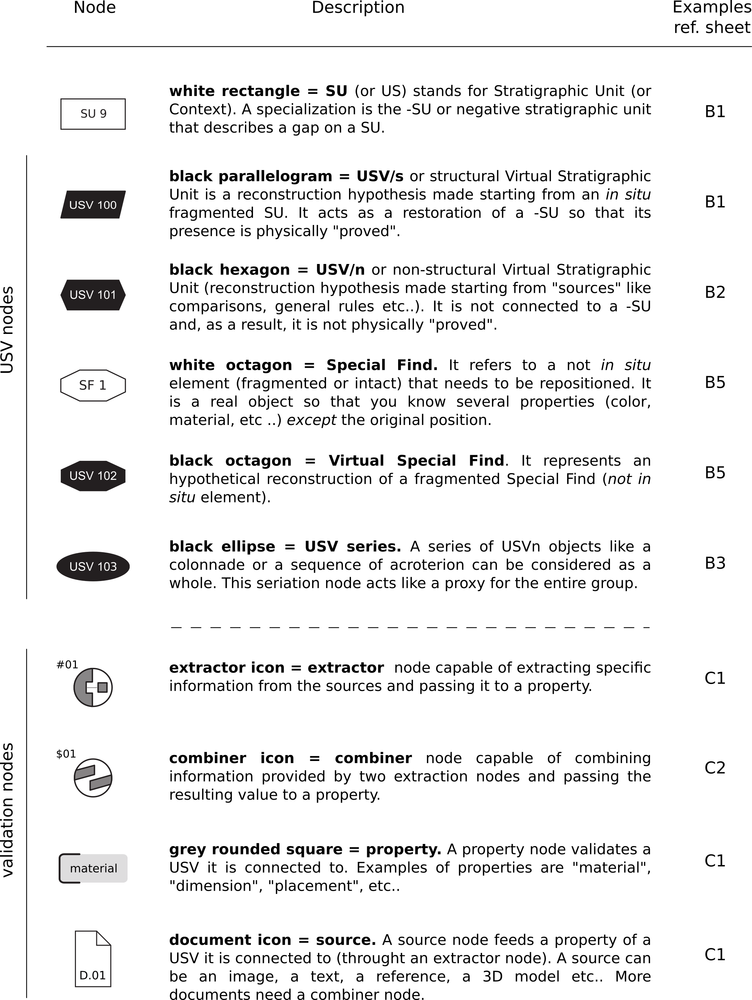

Validation nodes have a unique name (as well as the USVs) in order to be correctly referenced. They follow a name convention model (see Fig. 2): extractor nodes are composed by a “D” plus a sequence of numbers  (i.e the first extractor of an EM will be #01). Combiner and document nodes uses respectively the “C” and “D.” prefix.

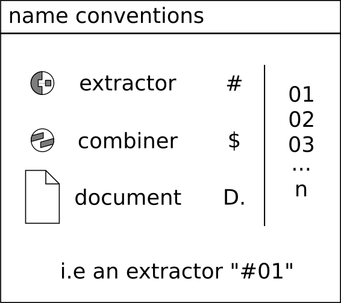

Extended Matrix nodes include all the graphic elements on the two-dimensional canvas except for the connecting lines between them, which are called arcs or connectors.

Nodes are divided into three major families: stratigraphic units, sources, and interpretation and reasoning nodes.

.. _usnodes_examples:

USV nodes, examples of use
--------------------------

Example of USV/s (structural virtual stratigraphic unit)
~~~~~~~~~~~~~~~~~~~~~~~~~~~~~~~~~~~~~~~~~~~~~~~~~~~~~~~~

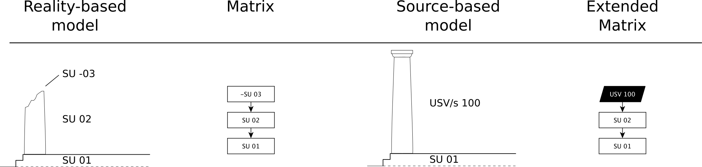

On top of a podium SU01 there is a SU02 (in situ), fragmented due to a -SU03 (destruction of the upper part of the column). A USV/s 100 hypothetical reconstruction is provisioned in order to restore the action of destruction -SU03.

Example of USV/n (non structural virtual stratigraphic unit)
~~~~~~~~~~~~~~~~~~~~~~~~~~~~~~~~~~~~~~~~~~~~~~~~~~~~~~~~~~~~

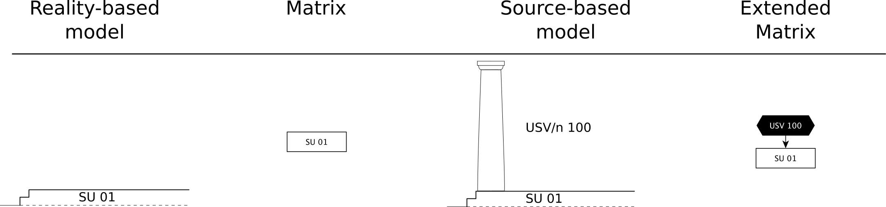

There are only the remains of a podium SU01. A USV/n 100 hypothetical reconstruction is provisioned (without physical destruction signs that prove the presence of a column).

Example of a series of USV/n (non structural virtual stratigraphic unit)
~~~~~~~~~~~~~~~~~~~~~~~~~~~~~~~~~~~~~~~~~~~~~~~~~~~~~~~~~~~~~~~~~~~~~~~~

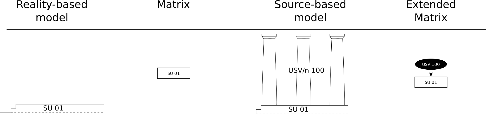

There are only the remains of a podium SU01. A USV/n 100  hypothetical reconstruction series of columns is provisioned (without physical destruction signs that prove the presence of a column). The series node allows to instance several USV/n at once.

Example of a USV/s and a series of USV/n
~~~~~~~~~~~~~~~~~~~~~~~~~~~~~~~~~~~~~~~~

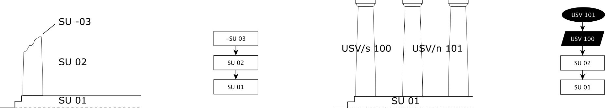

On top of a podium SU01 there is a column SU02 (in situ) fragmented due to a -SU03 (destruction of the upper part of the column). A USV/s 100 hypothetical reconstruction is provisioned in order to restore the destruction’s action -SU03. A series USV/n 101 is provided in order to complete the peristasis of the temple.

Example of a USV/n based on Special Finds (non in situ) elements
~~~~~~~~~~~~~~~~~~~~~~~~~~~~~~~~~~~~~~~~~~~~~~~~~~~~~~~~~~~~~~~~

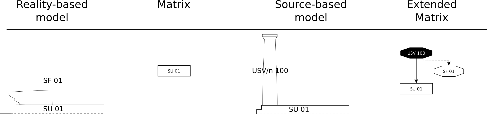

There are only the remains of a podium SU01 with a collapsed column SF01. A USV/n 100 hypothetical reconstruction is provisioned using the SF as a source. This kind of USV/n has a special status: see “USV and validation nodes” section on top of this page.

Example of a USV/n series based on Special Finds (non in situ) elements
~~~~~~~~~~~~~~~~~~~~~~~~~~~~~~~~~~~~~~~~~~~~~~~~~~~~~~~~~~~~~~~~~~~~~~~~

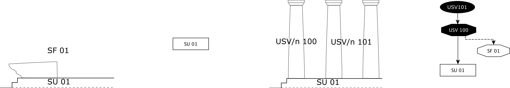

There are only the remains of a podium SU01 with a collapsed column SF01 (special find 01). A USV/n 100 series hypothetical reconstruction of the columnade is provisioned using the SF as a source.

Cumulative example of different USV nodes used togheter
~~~~~~~~~~~~~~~~~~~~~~~~~~~~~~~~~~~~~~~~~~~~~~~~~~~~~~~~~~~~~~~~

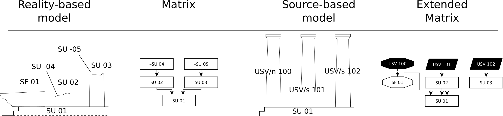

USV/s and USV/n are used togheter. Different -SU allow to propose different USV/s.

.. _validation_nodes_examples_use:

Validation nodes: examples of use
---------------------------------

The USV is a hypothesis with three levels of certainty (structural-non structural-special find reintegration) that have some properties; these properties are based on: sources (nodes), interpretation of sources (extractor nodes) and reasoning (combiner nodes), following the DIKW schema Data-Information-Wisdom-Knowledge.

Example of a property based on a single source
~~~~~~~~~~~~~~~~~~~~~~~~~~~~~~~~~~~~~~~~~~~~~~

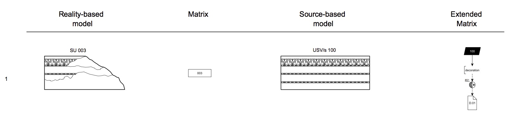

There is a fragmentary lintel SU003 and a reconstructed USV/s 100 is provisioned. A “decoration” property is declared and supported by a source D.01 (picture of the Temple of Mars at Rome). The interpretation of the source #01 extracts the part of the source useful to support the property above “decoration”. The content of paradata nodes are visible at paragraph 3.3.

Example of a property based on two sources
~~~~~~~~~~~~~~~~~~~~~~~~~~~~~~~~~~~~~~~~~~

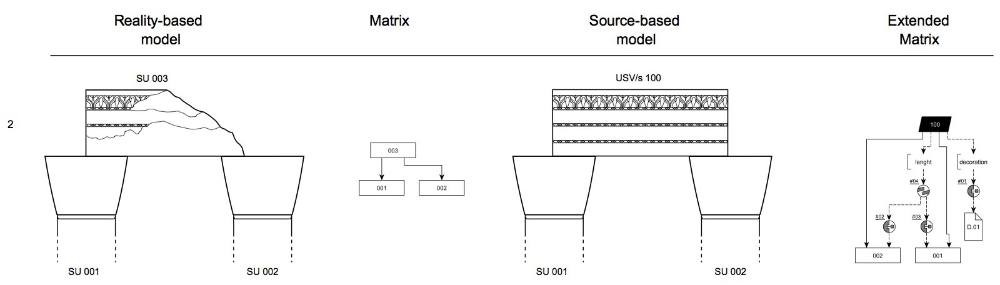

There is a fragmentary lintel SU003 on top of two columns SU001 and SU002. A USV/s 100 provide a hypothesis of virtual reconstruction and two properties are declared: lenght and decoration (see previous paragraph). The lenght property is based on two sources, namely the position of the columns used to extract the overall lenght of the lintel. The content of paradata nodes are visible at paragraph 3.3.

Example of a validation node table
~~~~~~~~~~~~~~~~~~~~~~~~~~~~~~~~~~

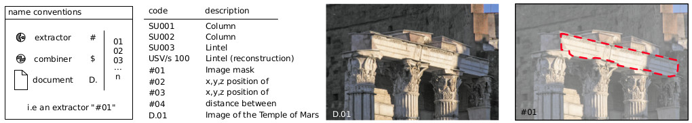

List of nodes used in the paragraphs 3.1 and 3.2:

.. _taxonomy:

Taxonomy of the EM
------------------

Validation nodes can have different values. These lists are not “closed”: users of the EM can add values in case of necessity.

.. _stratigraphicunits:

General background on stratigraphic units
-----------------------------------------

A stratigraphic unit in some academic scholarships is also known as locus or context. It indicates the result of an action that occurred at a specific moment in time. The result (the construction of a wall, the destruction of a roof, is the silt deposited on top of structures following a flood, the chemical change of surfaces due to a fire) in turn have a life span that ends with the moment it is defunctionalized (destroyed, abandoned, buried). 

Stratigraphic units that are of different types: real stratigraphic unit relating to something still existing or stratigraphically documented, documentary stratigraphic tip that the family of virtual stratigraphic units (relating to objects that no longer exist and need to be reconstructed). Abstract limits that are of different types: real stratigraphic unit relating to something still existing or stratigraphically documented, documentary stratigraphic tip that the family of virtual stratigraphic units (relating to objects that no longer exist and need to be reconstructed)

.. _us:

Stratigraphic Unit - US
-----------------------

It is the graphic and conceptual sign we use to number and define objects found still in situ (and noted using the techniques of stratigraphic reading).

.. _usd:

Documentary Stratigraphic Unit - USD
------------------------------------

The Documentary Stratigraphic Unit (USD) represents an element whose existence is certain due to a source considered reliable (a text, a drawing).

It connects to these properties:

* existence
* geometry
* placement
* material
* color
* etc..

.. +------------------------+------------+----------+----------+
.. | Header row, column 1   | Header 2   | Header 3 | Header 4 |
.. | (header rows optional) |            |          |          |
.. +========================+============+==========+==========+
.. | body row 1, column 1   | column 2   | column 3 | column 4 |
.. +------------------------+------------+----------+----------+
.. | body row 2             | ciao       | ciao     |          |
.. +------------------------+------------+----------+----------+

