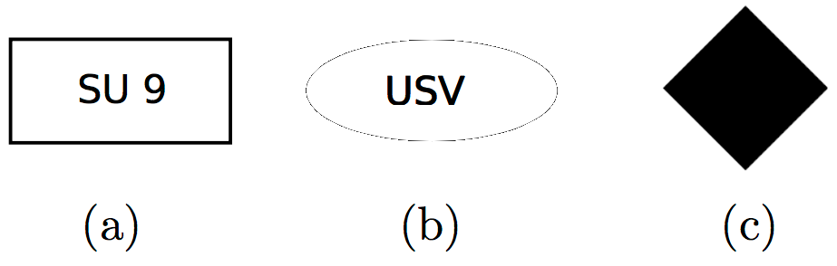
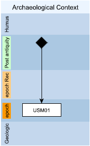

Time management in the EM
========================

.. _time_nodes:

Time Nodes
------------

The representation of nodes in the EM also allows the temporal dimension to be handled, indicating whether SUs are still in existence. Single SUs still existing are represented with a rectangle, SUs in series with an ellipse, while the continuity of a SU's life through the phases is represented with a black rhombus. 

  Extended Matrix nodes related to still existing SUs.

.. _continuity:

Continuity nodes
--------------------

The Extended Matrix makes it possible to represent the lifespan of a stratigraphic unit, enclosed between the moment of its execution and the moment of its destruction or de-functionalisation. In EM, the continuity of life is expressed through a continuity node (a black rhombus that marks the end of the life of the stratigraphic unit (the beginning is marked by the stratigraphic unit itself).

  Use of the continuity node connected to the SU of which it expresses the end of life.

