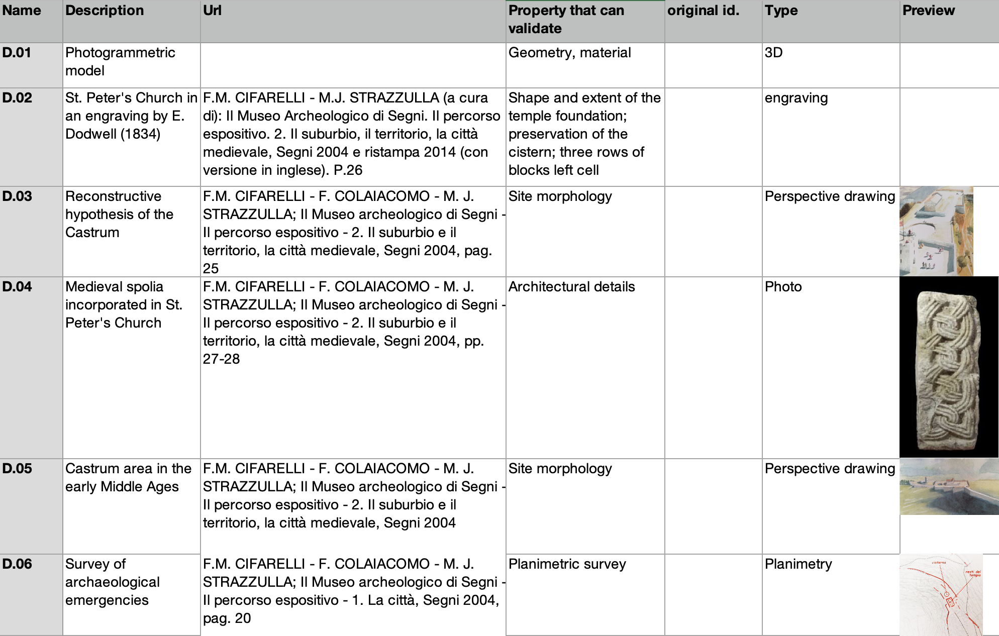

Document Nodes: Managing Archaeological Sources
============================================

.. _documentnodes_extended:

Introduction
-----------

Document nodes (also known as source nodes) are fundamental elements in the Extended Matrix framework, representing primary and secondary sources that support our archaeological interpretations. As described in the paradata nodes section, they form part of the validation chain for archaeological properties. This chapter provides an operational deep-dive into how to effectively manage and organize these sources in practice.
Each document is assigned a unique identifier (e.g., "D.01", "D.02") that serves as a reference throughout the documentation process.

.. note::
   :class: admonition-purple

   The structured version of the Document (Source) Nodes is available in JSON format at  
   `EM Blender Tools - Document Types JSON <https://github.com/zalmoxes-laran/EM-blender-tools/blob/EMtools_3dgraphy/s3Dgraphy/JSON_config/em_document_types.json>`_.

`new` 3D representation of Document Nodes
-----------------------------------------

Document nodes can be represented in 3D space as a collection of digital assets, each corresponding to a specific source. These assets can be visualized in a virtual environment, providing a spatial representation of the documentation sources. The 3D representation is normally created withih the context of a 3D model of the archaeological site or object. In the EM framework, the 3D representation of document nodes is used to visualize the spatial distribution of sources and their relationships to the archaeological properties they validate. They are created using the Blender software and can be exported along with the overall scene in the GLTF format to be reused in EMviq or in Heriverse web-app.

The canonical document and its use-instances
--------------------------------------------

A document usually appears in the matrix more than once: it is drawn where it
was produced, and again wherever a reasoning chain leans on it. Those are not
different documents — they are the same one, seen from different places in the
argument. The Extended Matrix keeps **one** document node in the graph and
distinguishes two roles in the drawing:

- the **canonical** document — the node placed at the moment the source itself
  came into being, carrying its identity, its dating and its classification;
- its **use-instances** — the repetitions that appear wherever the document is
  used, positioned at the time of *use*, not of creation.

The distinction is visual as well as structural: the canonical document is drawn
with a **thick** border, an instance with a thin one; the border **colour**
classifies the canonical document along the geometry axis (see the three-axis
classification below).

.. note::
   :class: admonition-purple

   Until EM 1.6 this role was called *master document*. The name was misleading:
   a digital document is always a copy, and "master" suggested an original among
   copies. What the role actually marks is the document **at its own moment of
   creation**, against the instances that re-use it — hence *canonical*. Files
   written before the rename keep loading: the older keys are read and
   normalised, nothing is lost.

Where the document lands in 3D: the RMDoc
-----------------------------------------

.. versionadded:: 1.6

A document and its position in space are two different things, and the Extended
Matrix keeps them apart. The document is a source: it exists, and its existence
is not a matter of degree. What *is* a matter of degree is the act of putting it
somewhere in the 3D scene — and that act has its own node, the **RMDoc**
(Representation Model Document).

The RMDoc belongs to a family of nodes that are all the same idea applied to
different conceptual nodes — the **spatial instance** of something the matrix
already knows about:

.. list-table::
   :header-rows: 1
   :widths: 20 20 60

   * - Spatial instance
     - of the node
     - typical case
   * - proxy
     - US
     - the volume standing for a stratigraphic unit
   * - RMSF
     - SF
     - a scanned capital repositioned by an anastylosis hypothesis
   * - RM
     - state
     - the model of a reconstructed state of the monument
   * - **RMDoc**
     - **Document**
     - a historical photograph placed where it was taken

An RMDoc is for an asset that **cannot sit in 3D without a transformation
matrix** — the origin (0,0,0) is an improbable place for it — and that normally
involves a point of view, a camera sighting the document: a section, an
elevation, an image. The typical case is a georeferenced 2D document used as a
base.

Two cases that look similar and are not:

* a **photogrammetric model used as a source** is *not* an RMDoc. It is an RM
  bound to its epoch, plus a Document. The document role and the spatial role
  are two facets of the same resource, and they are not exclusive;
* an asset that is **already 3D and already an RM** does not generate an RMDoc.
  It is already in space on its own terms.

Unlike an RM, an RMDoc is never anchored to an epoch or to a stratigraphic unit.
It hangs from its document:

.. code-block:: text

   Document ──has_representation_model_doc──▶ RMDoc ──has_linked_resource──▶ file

The position itself — X, Y, Z and rotation — lives **on the RMDoc and nowhere
else**. The Document may show the same classification on its border in yEd, for
the convenience of reading the diagram, but it does not carry a position.

The geometry axis: how metric is the placement
~~~~~~~~~~~~~~~~~~~~~~~~~~~~~~~~~~~~~~~~~~~~~~

Axis 3 of the classification, ``geometry``, is a scale of **metric authority of
placement**. It grades the spatialisation, not the document: it answers "on what
authority does this thing sit here?", from a measurement to a gesture.

.. list-table::
   :header-rows: 1
   :widths: 18 12 70

   * - Value
     - Border
     - What it claims
   * - ``reality_based``
     - red
     - Sensor or algorithmic positioning: a photogrammetric model, a photo from
       a calibrated sequence, an instrumentally surveyed find.
   * - ``observable``
     - orange
     - Reconstructed with approximation from rigorous documentation (plans,
       sections, measured drawings). Criterion-based; residual uncertainty
       remains.
   * - ``asserted``
     - yellow
     - Compositional positioning asserted by the operator, with no claim of
       restitution — placing a comparative element where it can be looked at.
   * - ``symbolic``
     - grey
     - The base is **not metric at all**: a map not to scale, a schematic plan,
       a sketch. The placement is useful, not measurable.

.. versionadded:: 1.6
   ``symbolic`` is the lowest rung, added so that a non-metric base is not
   forced to masquerade as ``asserted``. The difference is where the missing
   metric lies: with ``asserted`` the base could have carried a measurement and
   the operator chose not to use one; with ``symbolic`` there was never a
   measurement to use.

``em_based`` sits outside this ladder. It is not a degree of metric authority
but a statement of provenance — the asset *is* itself an EM-derived
reconstruction, typically a hypothesis model built from another EM graph. That
says nothing about how well it is placed.

A canonical document that has no geometry classification yet is drawn with a
**thick black** border (``canonical_unknown``): not classified, which is not the
same as classified as non-metric. Grey means someone looked and decided.

Spatialisation has degrees; temporality is an attribution
~~~~~~~~~~~~~~~~~~~~~~~~~~~~~~~~~~~~~~~~~~~~~~~~~~~~~~~~~

These two are easy to confuse and must not be. For an RMDoc:

* the **spatialisation** has degrees, and they are the four values above.
  "Where is it, and on what authority" is a graded question;
* the **temporality** is an *attribution*, not a grade. A document is dated
  either with certainty or through a paradata chain that argues the dating.
  There is no rung of the geometry axis that means "probably 1930s".

Keeping them apart is what lets a photograph be firmly dated and loosely placed,
or precisely placed and vaguely dated, without either statement contaminating
the other.

Document Types and Classification
-------------------------------

The Extended Matrix framework organizes documentation into standardized categories, each mapped to established cultural heritage vocabularies.

Spatial Documentation
~~~~~~~~~~~~~~~~~~~
:Getty AAT: `300389935 <http://vocab.getty.edu/aat/300389935>`_
:CIDOC CRM: :class:`E36_Visual_Item` with property :property:`P67_refers_to`
:Dublin Core: ``dcterms:spatial``

Documents containing spatial information and measurements:

* **3D Models**
    * Formats: GLTF, OBJ, PLY, FBX, 3DS, E57
    * Key extractions: dimensions, spatial relationships, geometric features
    * Required metadata:
        * creation_date
        * creator
        * software_used
        * coordinate_system
        * spatial_resolution
    * Optional metadata:
        * accuracy_assessment
        * processing_workflow
        * registration_method
        * point_cloud_density
    * Supported extractors:
        * 3D model analysis
        * Geometric analysis
        * Spatial pattern analysis

* **Technical Drawings**
    * Formats: DWG, DXF, PDF, SVG
    * Key extractions: dimensions, construction details, spatial layout
    * Required metadata:
        * creation_date
        * author
        * scale
        * drawing_type
        * reference_system
    * Optional metadata:
        * revision_history
        * drawing_conventions
        * associated_specifications

Scientific Documentation
~~~~~~~~~~~~~~~~~~~~~~
:Getty AAT: `300379612 <http://vocab.getty.edu/aat/300379612>`_
:CIDOC CRM: :class:`E31_Document` with property :property:`P140_assigned_attribute_to`

* **Material Analysis Reports**
    * Formats: PDF, DOCX, XLSX
    * Key extractions: 
        * material_composition
        * physical_properties
        * chemical_properties
        * degradation_patterns
    * Required metadata:
        * analysis_date
        * laboratory
        * analysis_method
        * sampling_strategy
        * analyst
    * Optional metadata:
        * equipment_used
        * calibration_data
        * error_margins

* **Dating Analysis Reports**
    * Formats: PDF, DOCX, XLSX
    * Key extractions:
        * absolute_date
        * date_range
        * dating_method_reliability
        * chronological_context
    * Required metadata:
        * analysis_date
        * laboratory
        * dating_method
        * sample_description
        * calibration_curve

Historical Documentation
~~~~~~~~~~~~~~~~~~~~~~
:Getty AAT: `300343082 <http://vocab.getty.edu/aat/300343082>`_
:CIDOC CRM: :class:`E31_Document` with property :property:`P70_documents`
:Dublin Core: ``dcterms:source``

* **Archival Documents**
    * Formats: PDF, TXT, DOCX, TIFF
    * Key extractions:
        * historical_context
        * construction_history
        * ownership_history
        * modification_events
    * Required metadata:
        * archive_reference
        * document_date
        * document_type
        * archival_location
    * Optional metadata:
        * transcription_details
        * preservation_state
        * access_restrictions

* **Historical Photographs**
    * Formats: TIFF, JPG, PDF
    * Key extractions:
        * historical_appearance
        * temporal_changes
        * architectural_features
        * urban_context
    * Required metadata:
        * photo_date
        * photographer
        * archive_reference
        * subject_location
    * Optional metadata:
        * camera_details
        * print_type
        * negative_reference

Conservation Documentation
~~~~~~~~~~~~~~~~~~~~~~~~
:Getty AAT: `300379612 <http://vocab.getty.edu/aat/300379612>`_
:CIDOC CRM: :class:`E31_Document` with property :property:`P140_assigned_attribute_to`
:Dublin Core: ``dcterms:provenance``

* **Condition Reports**
    * Formats: PDF, DOCX, XLSX
    * Key extractions:
        * conservation_state
        * degradation_patterns
        * risk_factors
        * intervention_priorities
    * Required metadata:
        * assessment_date
        * assessor
        * assessment_method
        * condition_classification
    * Optional metadata:
        * environmental_data
        * previous_treatments
        * monitoring_history

* **Intervention Reports**
    * Formats: PDF, DOCX, XLSX
    * Key extractions:
        * treatment_methods
        * materials_used
        * intervention_results
        * follow_up_recommendations
    * Required metadata:
        * intervention_date
        * conservator
        * intervention_type
        * materials_used
        * documentation_method
    * Optional metadata:
        * preliminary_tests
        * environmental_conditions
        * post_treatment_monitoring

.. note::
   All Getty AAT links point to the Art & Architecture Thesaurus, providing standardized terminology for cultural heritage documentation. CIDOC CRM mappings follow the latest version (7.1.1) of the standard.

Source List Tool
--------------

   
   The Source List tool provides a structured approach to collecting and organizing documentary sources. Each row represents a document with its metadata and potential validation properties.

The Source List is designed to track:
* Document identification (unique ID)
* Description of the source
* Original bibliographic reference or URL
* Properties that can be validated using this source
* Document type (3D model, photo, drawing, text, etc.)
* Preview (when available)

.. _source-list-schema:

Source List schema
~~~~~~~~~~~~~~~~~~

.. versionadded:: 1.3
   Introduced as the *formalized source list for data collection*.

.. versionchanged:: 1.6
   Two-sheet structure (Analytical / Comparative Sources) canonicalised.
   The *Type* column is promoted to a closed controlled vocabulary
   aligned with the DocumentNode three-axis classification (DP-07).
   The Source List can now be merged directly into the ``Documents``
   sheet of ``em_data.xlsx`` (DP-02) without manual duplication. See
   DP-58 in the development projects index at
   https://docs.extendedmatrix.org/projects/development-projects/.

The Source List is a single-purpose XLSX file (``source_list.xlsx``)
sitting at the project root next to the ``.graphml``. It registers
every bibliographic and archival source referenced by Document nodes
in the graph and assigns each one a stable project-local identifier
(``D.NN``) that propagates to the DosCo folder and to the graph itself.

**Sheet structure (Analytical vs Comparative)**

A 1.6 Source List workbook contains two sheets, anchored on
DocumentNode Axis 1 (*role*):

* ``Analytical Sources`` — primary sources for *this* reconstruction
  (excavation reports of the site, surveys, dossiers).
* ``Comparative Sources`` — external references and analogies
  (parallels from other sites, treatises, comparative iconography).

Both sheets share the same 8-column schema. Single-sheet workbooks
named ``sources`` (the legacy 1.3 layout) are still accepted by all
importers for backward compatibility.

**Column reference**

.. list-table::
   :header-rows: 1
   :widths: 14 22 16 24 10 14

   * - Column
     - Purpose
     - Format
     - Example
     - Required
     - Maps to (DP-07)
   * - **Name**
     - Project-local unique ID
     - ``D.NN`` (zero-padded, sequential)
     - ``D.01``
     - yes
     - DocumentNode ``id``
   * - **Description**
     - Natural-language description of the source
     - Free text, ~1 sentence
     - "Photogrammetric model of the Great Temple, 2015"
     - yes
     - DocumentNode ``description``
   * - **Url**
     - Citation / DOI / web URL
     - Bibliographic citation or URL
     - "Daicoviciu H. et al., *Sargetia* XIV, 1979"
     - recommended
     - DocumentNode ``url``
   * - **Property that can validate**
     - Qualia / properties this source can support
     - Comma-separated names (see :doc:`qualia`)
     - ``geometry, material, elevation``
     - recommended
     - Drives ExtractorNode targeting
   * - **original id.**
     - Archive or library reference
     - Free text
     - "ASR, Fondo Disegni, b.12, c.34r"
     - optional
     - DocumentNode ``archive_reference``
   * - **Type**
     - Source typology (closed vocabulary [#typevocab16]_)
     - One of: ``3d``, ``pdf``, ``image``, ``map``, ``text``, ``audio``, ``dataset``
     - ``pdf``
     - yes
     - Axis 2 ``content_nature`` + Axis 3 ``geometry``
   * - **Preview**
     - Optional thumbnail
     - Embedded image cell
     - —
     - optional
     - UI hint (Document Manager)
   * - **Notes**
     - Free-form annotations
     - Free text
     - "OCR quality low for pp. 142–148"
     - optional
     - DocumentNode ``notes``

.. [#typevocab16] The 1.6 *Type* vocabulary is the canonical projection
   of DP-07 Axes 2 and 3 onto a flat label set:
   ``3d`` → 3d_object + reality_based;
   ``pdf`` / ``text`` → 2d_object (no geometry);
   ``image`` / ``map`` → 2d_object + observable;
   ``audio`` / ``dataset`` → no geometry.
   Importers translate each Type back into the full three-axis tuple at
   ingest time.

**Worked example (excerpt)**

.. list-table::
   :header-rows: 1
   :widths: 8 28 26 24 6 8

   * - Name
     - Description
     - Url
     - Property that can validate
     - Type
     - Notes
   * - D.01
     - Photogrammetric model of the Great Temple
     - Demetrescu E., 2015 (unpublished)
     - geometry, material, elevation, surface_treatment
     - 3d
     -
   * - D.02
     - Excavation report 1975–1977
     - Daicoviciu H. et al., *Sargetia* XIV, 1979, pp. 139–154
     - stratigraphy, architecture, dimensions, construction_technique
     - pdf
     - OCR low pp. 142–148

**Integration with em_data.xlsx (DP-02)**

When a ``Documents`` sheet is missing in a project's ``em_data.xlsx``
(DP-02 StratiMiner pipeline), the importer can pull it directly from
``source_list.xlsx``: the 8 columns above map one-to-one onto the
em_data Documents schema with the *Type* column unfolding into the
two DP-07 axes. This eliminates the previous duplication where authors
had to maintain the same source registry in two files.

.. seealso::

   * :doc:`extractor_nodes` — how the *Property that can validate*
     column drives the validation chain.
   * :doc:`qualia` — the property vocabulary used in column 4.
   * :doc:`project_organization` — DosCo folder layout and ``D.NN`` ID
     propagation from the Source List to the file system.

Team Organization: The Source Hunter
---------------------------------

The collection and organization of sources can be efficiently managed by assigning a dedicated team member (the "source hunter") to:
* Search and collect relevant documentation from libraries and archives
* Organize digital resources
* Maintain the source list
* Track validation properties for each source

Document Organization: The DosCo System
------------------------------------

Sources are organized in a Dossier Comparativ (DosCo) folder structure where:

1. Each document maintains its unique identifier as a prefix
2. Original filenames are preserved after the prefix
3. Digital files follow the naming convention:
   ``D.XX_original_filename.extension``

Example::

    DosCo/
    ├── D.01_photogrammetric_survey_temple.pdf
    ├── D.02_dodwell_engraving_1834.jpg
    ├── D.03_castrum_reconstruction.pdf
    └── ...

Properties Validation Column
-------------------------

A key feature of the Source List is the "Property that can validate" column, which:
* Identifies specific properties that can be validated using each source
* Helps in building the validation chain through paradata nodes
* Guides the creation of extractor nodes
* Supports evidence-based property documentation

Examples of validation properties:
* Geometrical measurements
* Material identification
* Construction techniques
* Architectural details
* Site morphology
* Spatial relationships

Best Practices
------------

1. **Source Collection:**
   * Systematically search both physical and digital archives
   * Document the origin and reliability of each source
   * Maintain high-quality digital copies

2. **Documentation:**
   * Use consistent naming conventions
   * Keep the Source List updated
   * Link sources to specific properties they can validate

3. **Team Coordination:**
   * Assign clear responsibilities for source collection
   * Regular updates to the Source List
   * Clear communication about validation needs

4. **Digital Organization:**
   * Maintain organized DosCo folders
   * Use consistent file naming
   * Ensure proper backup of digital sources

This systematic approach to source management ensures that:
* All interpretations are properly documented
* Sources are easily retrievable
* The validation chain remains clear and verifiable
* Team members can efficiently collaborate on documentation