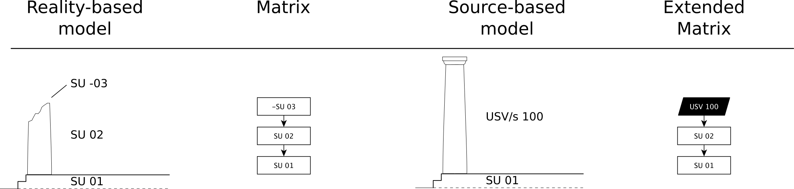
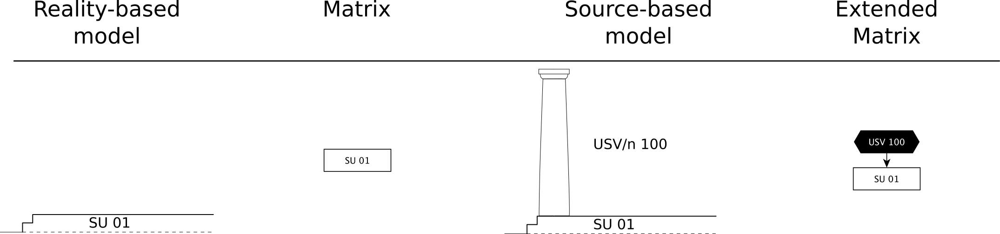
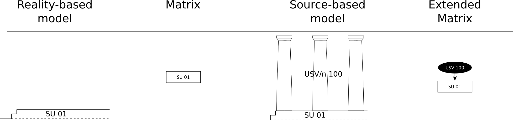
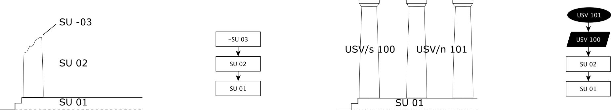
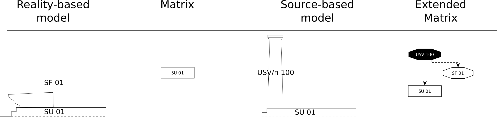
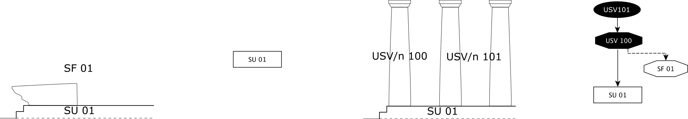
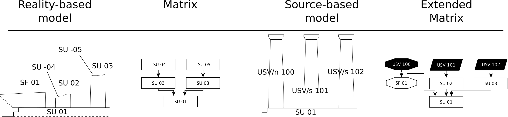

Stratigraphic Nodes of the EM
=============================

.. _stratigraphicunits:

General background on stratigraphic units
-----------------------------------------

A stratigraphic unit in some academic scholarships is also known as locus or context. It indicates the result of an action that occurred at a specific moment in time. The result (the construction of a wall, the destruction of a roof, is the silt deposited on top of structures following a flood, the chemical change of surfaces due to a fire) in turn have a life span that ends with the moment it is defunctionalized (destroyed, abandoned, buried). 

Stratigraphic units that are of different types: real stratigraphic unit relating to something still existing or stratigraphically documented, documentary stratigraphic tip that the family of virtual stratigraphic units (relating to objects that no longer exist and need to be reconstructed). Abstract limits that are of different types: real stratigraphic unit relating to something still existing or stratigraphically documented, documentary stratigraphic tip that the family of virtual stratigraphic units (relating to objects that no longer exist and need to be reconstructed)

.. _us:

Stratigraphic Unit - US
-----------------------

It is the graphic and conceptual sign we use to number and define objects found still in situ (and noted using the techniques of stratigraphic reading).

.. _usvnodes:

USV/s node:
-----------

Lorem ipsum [definition]

Example of USV/s (structural virtual stratigraphic unit)
~~~~~~~~~~~~~~~~~~~~~~~~~~~~~~~~~~~~~~~~~~~~~~~~~~~~~~~~

On top of a podium SU01 there is a SU02 (in situ), fragmented due to a -SU03 (destruction of the upper part of the column). A USV/s 100 hypothetical reconstruction is provisioned in order to restore the action of destruction -SU03.

USV/n node:
-----------

Lorem ipsum [definition]

Example of USV/n (non structural virtual stratigraphic unit)
~~~~~~~~~~~~~~~~~~~~~~~~~~~~~~~~~~~~~~~~~~~~~~~~~~~~~~~~~~~~

There are only the remains of a podium SU01. A USV/n 100 hypothetical reconstruction is provisioned (without physical destruction signs that prove the presence of a column).

.. _usvseries:

USV series node:
----------------

Lorem ipsum [definition]

Example of a series of USV/n (non structural virtual stratigraphic unit)
~~~~~~~~~~~~~~~~~~~~~~~~~~~~~~~~~~~~~~~~~~~~~~~~~~~~~~~~~~~~~~~~~~~~~~~~

There are only the remains of a podium SU01. A USV/n 100  hypothetical reconstruction series of columns is provisioned (without physical destruction signs that prove the presence of a column). The series node allows to instance several USV/n at once.

Example of a USV/s and a series of USV/n
~~~~~~~~~~~~~~~~~~~~~~~~~~~~~~~~~~~~~~~~

On top of a podium SU01 there is a column SU02 (in situ) fragmented due to a -SU03 (destruction of the upper part of the column). A USV/s 100 hypothetical reconstruction is provisioned in order to restore the destruction’s action -SU03. A series USV/n 101 is provided in order to complete the peristasis of the temple.

.. _sfnodes:

Special Find node:
------------------

Lorem Ipsum [definition]

Example of a USV/n based on Special Finds (non in situ) elements
~~~~~~~~~~~~~~~~~~~~~~~~~~~~~~~~~~~~~~~~~~~~~~~~~~~~~~~~~~~~~~~~

There are only the remains of a podium SU01 with a collapsed column SF01. A USV/n 100 hypothetical reconstruction is provisioned using the SF as a source. This kind of USV/n has a special status: see “USV and validation nodes” section on top of this page.

Example of a USV/n series based on Special Finds (non in situ) elements
~~~~~~~~~~~~~~~~~~~~~~~~~~~~~~~~~~~~~~~~~~~~~~~~~~~~~~~~~~~~~~~~~~~~~~~

There are only the remains of a podium SU01 with a collapsed column SF01 (special find 01). A USV/n 100 series hypothetical reconstruction of the columnade is provisioned using the SF as a source.

Cumulative example of different USV nodes used togheter
~~~~~~~~~~~~~~~~~~~~~~~~~~~~~~~~~~~~~~~~~~~~~~~~~~~~~~~

USV/s and USV/n are used togheter. Different -SU allow to propose different USV/s.

.. _usd:

Documentary Stratigraphic Unit - USD
------------------------------------

The Documentary Stratigraphic Unit (USD) represents an element whose existence is certain due to a source considered reliable (a text, a drawing).

It connects to these properties:
~~~~~~~~~~~~~~~~~~~~~~~~~~~~~~~~

* existence
* geometry
* placement
* material
* color
* etc..

.. _se:

.. _note:

  Starting from here expect new features for EM 1.5

New Stratigraphic Event Node
----------------------------

A **Stratigraphic Event Node** represents an event or action that precedes and results in the formation of a stratigraphic unit. This new node captures not just the unit itself, but the process that leads to the creation, modification, or transformation of the unit. By introducing this concept, it is possible to model both the temporal and spatial dimensions of how a stratigraphic unit comes to exist.

**Definition**

A stratigraphic event is the process or event that leads to the formation or alteration of a stratigraphic unit. It is distinct from the unit itself, which represents the result or outcome of the event. The event can be thought of as a precursor and can be paired with its resulting unit to provide a more detailed temporal range. This allows for the documentation of both the initial moment of action (e.g., the start of construction, a collapse, or an incision) and the final state (the resulting unit that persists over time).

**Use Cases**

The inclusion of **Stratigraphic Event Nodes** is useful in cases where the event is significant enough to be recorded, either because it marks a key phase in the creation of the unit or because it involves complex interactions such as displacement, rotation, or fragmentation. 

For example:

1. **Construction of a Wall**:
   The stratigraphic event would document the beginning of the construction process, such as the laying of the foundation stone. The result of this event is the completion of the wall, which becomes a permanent stratigraphic unit. By defining the event separately, the duration of construction can be modeled, from the first stone laid to the final brick placed.

2. **Collapse of a Painted Ceiling**:
   When a ceiling collapses, the event can involve both displacement and rotation. For instance, a fragment of a painted ceiling might fall from a height of 3 meters and rotate 180 degrees before coming to rest on the floor. The event node captures the movement (spatial displacement, rotation) and the forces at play. The resulting stratigraphic unit would then be the fragments on the floor, possibly broken, but distinct from the original ceiling. 

   In this example, a simulation could demonstrate how the fragment, constrained by its attachment at one side (e.g., due to incannaciatura), rotated during its fall, showing that it did not break during its 180-degree rotation. This validated stratigraphic event is key to understanding how the unit was transformed.

3. **Cut for a New Window**:
   In the case of cutting through a wall to create a new window, the event is the cutting action itself, which modifies the wall. The resulting stratigraphic unit is the modified wall with the new window. The stratigraphic event details the process of cutting, while the unit is the altered wall that remains after the event.

**Properties**

Each **Stratigraphic Event Node** can have the following properties:

- **Start Time**: The initiation of the event.
- **End Time**: The conclusion of the event (e.g., when the wall is completed or when the collapse ends).
- **Spatial Displacement**: If the event involves movement, this property records the spatial shift (e.g., distance fallen, rotation angle).
- **Cause**: The reason for the event, such as construction, collapse, or erosion.
- **Validation Source**: For events validated through simulations or analysis, this property records the source of validation.

**Pairing with Stratigraphic Units**

Stratigraphic Event Nodes are always paired with their resulting stratigraphic units. This pairing creates a temporal link that captures the event’s duration and its outcome. In scenarios where multiple events lead to a single stratigraphic unit (e.g., incremental construction), multiple event nodes can be associated with the same unit.

It connects to these nodes:
~~~~~~~~~~~~~~~~~~~~~~~~~~~

* Stratigraphic Unit
* Property Node

.. +------------------------+------------+----------+----------+
.. | Header row, column 1   | Header 2   | Header 3 | Header 4 |
.. | (header rows optional) |            |          |          |
.. +========================+============+==========+==========+
.. | body row 1, column 1   | column 2   | column 3 | column 4 |
.. +------------------------+------------+----------+----------+
.. | body row 2             | ciao       | ciao     |          |
.. +------------------------+------------+----------+----------+

