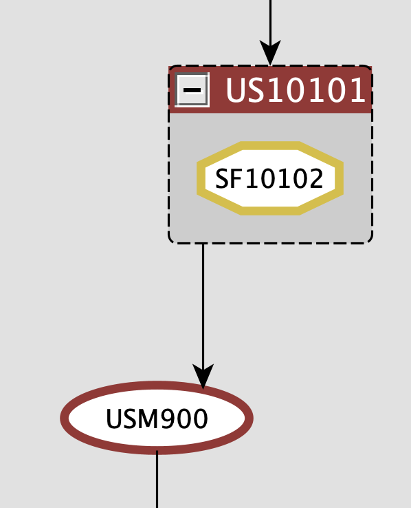
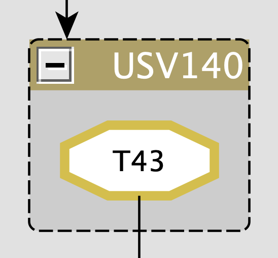

Stratigraphic Nodes
===================

.. _stratigraphicunits:

General background on stratigraphic units (``StratigraphicNode``)
-----------------------------------------------------------------

A stratigraphic unit in some academic scholarships is also known as locus or context. It indicates the result of an action that occurred at a specific moment in time. The result (the construction of a wall, the destruction of a roof, is the silt deposited on top of structures following a flood, the chemical change of surfaces due to a fire) in turn have a life span that ends with the moment it is defunctionalized (destroyed, abandoned, buried). It has a spatio-temporal nature: temporal persistence of a geometry in a given point in space. When the position change, the US will change its nature.

.. tip:: Stratigraphic Units as Storytelling Tools
   
   Think of stratigraphic units as a specialized alphabet for telling the story of a place through time. Just as a writer uses words to craft a narrative, archaeologists and heritage specialists use stratigraphic units to document the biography of a site, piece by piece:

   - Each wall, window, column base, and architectural element is a character in the story
   - Every destruction event (collapse, fire, removal) marks a dramatic turning point
   - Each reconstruction or restoration represents a new chapter
   - Additional elements (lanterns, furniture, decorations) enrich the setting
   - Even historical figures who inhabited the space can be part of the narrative

   Stratigraphic units are remarkably versatile - they can express both tangible and intangible concepts. As you read through the following node types, think of them as letters in your storytelling alphabet. Each node represents a moment in time that created a result, whether physical (like a new wall) or conceptual (like a change in function).

   By combining these "letters" into "words" and "sentences," you can document everything from major architectural transformations to subtle changes in how spaces were used and perceived through time. This makes stratigraphy not just a technical tool, but a powerful narrative device for understanding and communicating the complete life story of a cultural heritage site.

.. note::
  More details about the stratigraphic approach can be found  `here <stratigraphic_approach.html>`_

Stratigraphic units can be classified into main categories:
-----------------------------------------------------------

1. Physical Stratigraphic Units
-------------------------------

These are tangible units that either still exist or have left clear stratigraphic evidence. They can be directly observed, measured, and analyzed in the field. Physical stratigraphic units include existing walls, floors, deposits, or archaeological remains that have been documented through proper stratigraphic methods.

.. _usnode:

1.1. SU - Stratigraphic Unit (``StratigraphicUnit``)
~~~~~~~~~~~~~~~~~~~~~~~~~~~~

.. image:: img/2D/US.png
  :width: 128px
  :align: left

A Stratigraphic Unit indicates the result of an action that occurred at a specific moment in time. The SU defines objects found still *in situ* (and noted using the techniques of stratigraphic reading). These are tangible units that either still exist or have left clear stratigraphic evidence. They can be directly observed, measured, and analyzed in the field. Physical stratigraphic units include existing walls, floors, deposits, or archaeological remains that have been documented through proper stratigraphic methods.

SU as Container
^^^^^^^^^^^^^^^

A Stratigraphic Unit can also act as a **container** for Special Finds (SF) or Virtual Special Finds (VSF). This represents the physical containment of elements within a stratigraphic unit -- for example, a reused capital (SF) embedded inside a wall (SU).

In the yEd GraphML editor, this is represented by drawing the SU as a **group node** with a dark red background (``#9B3333``) and placing the contained elements inside it. On import, each contained element receives an ``is_part_of`` edge pointing to the SU container. The SU retains all its normal stratigraphic relationships.

   A Stratigraphic Unit (US10101) acting as a container for a Special Find (SF10102). In the GraphML, the SF is nested inside the US group node.

.. seealso::
   :ref:`ispartof` for details on the ``is_part_of`` connector.

.. _serusnode:

1.2. serSU - Serial Stratigraphic Unit (``SeriesOfStratigraphicUnit``)
~~~~~~~~~~~~~~~~~~~~~~~~~~~~~~~~~~~~~~~~~~~~~~~~~~~~~~~~~~~~~~~~~~~~~

.. image:: img/2D/serSU.png
  :width: 128px
  :align: left

A Serial Stratigraphic Unit is employed when it is more practical and efficient to use a single unit to represent multiple serial elements of the same type. This approach is particularly useful for documenting architectural features such as a sequence of capitals, a series of column bases, a set of roof beams, or similar repetitive elements.

This type of serial documentation is specifically used when the elements in the series are geometrically discontinuous - meaning they do not physically touch each other. Examples include multiple wall segments that are spatially separated, freestanding column bases, or other architectural elements that share similar characteristics but are not physically connected.
The flexibility of this system allows for individual elements to be removed from the series and documented separately at any time, should they present unique characteristics or require detailed individual documentation. This might occur when an element shows distinctive decorative features, exhibits unusual wear patterns, or presents specific conservation issues that warrant individual attention.

.. _serusdnode:

2. USD - Documentary Stratigraphic Units (``DocumentaryStratigraphicUnit``)
---------------------------------------------------------------------------

These units are identified through indirect documentation, such as historical records, geophysical surveys, and other analytical techniques. Their existence is substantiated by methods including geophysics, thermography, remote sensing, and by reliable historical sources such as photographs, paintings, artistic representations, written descriptions, maps, plans, and oral histories. Although not physically present, these units can be confidently positioned within the stratigraphic sequence based on documentary evidence. This category also encompasses repositioned elements (anastylosis) when their original placement is verified through historical documentation.

.. image:: img/2D/USD.png
  :width: 128px
  :align: left

It connects to these properties:
~~~~~~~~~~~~~~~~~~~~~~~~~~~~~~~~

- existence
- geometry
- placement
- material
- color
- etc..

USD as Container
^^^^^^^^^^^^^^^^

Like the SU, a Documentary Stratigraphic Unit can act as a **container** for Special Finds. This represents a documentary context that includes specific elements -- for example, a documentary unit identified from archival sources that is known to have contained a particular artifact.

In yEd, this is represented as a **group node** with an orange background (``#D86400``). On import, contained elements receive ``is_part_of`` edges pointing to the USD container.

.. seealso::
   :ref:`ispartof` for details on the ``is_part_of`` connector.

2.1. serUSD - Serial Documentary Stratigraphic Unit (``SeriesOfDocumentaryStratigraphicUnit``)
~~~~~~~~~~~~~~~~~~~~~~~~~~~~~~~~~~~~~~~~~~~~~~~~~~~~~~~~~~~~~~~~~~~~~~~~~~~~~~~~~~~~~~~~~~~~~~

A Serial Documentary Stratigraphic Unit is employed when it is more practical and efficient to use a single unit to represent multiple serial documentary elements of the same type. This approach is particularly useful for documenting groups of documentary stratigraphic units that share similar characteristics and are identified through the same type of indirect documentation (historical records, geophysical surveys, etc.).

Like the serSU, this type of serial documentation is used when the elements in the series are geometrically discontinuous. Individual elements can be removed from the series and documented separately at any time, should they present unique characteristics or require detailed individual documentation.

.. _usd:

3. Virtual Stratigraphic Units (USV)
------------------------------------

These represent elements that no longer exist and must be reconstructed. Their existence is inferred through presence of physical gaps on archaeological evidence, analysis of surrounding structures, architectural necessity, and comparative studies. Virtual units are essential for understanding the complete stratigraphic sequence, even though they cannot be directly observed. Their reconstruction requires careful analysis and interpretation of available evidence. 

They are divided into:

.. _usvnodes:

3.1 USV/s - Structural Stratigraphic Unit (``StructuralVirtualStratigraphicUnit``)
~~~~~~~~~~~~~~~~~~~~~~~~~~~~~~~~~~~~~~~~~

.. image:: img/2D/USVs.png
  :width: 128px
  :align: left

Structural Virtual Stratigraphic Unit, a reconstruction hypothesis based on an in situ fragmented SU. It acts as a restoration of a -SU, making its presence "physically proven."

.. figure:: img/B01.png
  :width: 600
  :align: center 
  
  Example: On top of a podium SU01 there is a SU02 (in situ), fragmented due to a -SU03 (destruction of the upper part of the column). A USV/s 100 hypothetical reconstruction is provisioned in order to restore the action of destruction -SU03.

3.2 USV/n - Non-Structural Stratigraphic unit (``NonStructuralVirtualStratigraphicUnit``)
~~~~~~~~~~~~~~~~~~~~~~~~~~~~~~~~~~~~~~~~~~~~~~~~~~~~~~~~~~~~~~~~~~~~~~~~~~~~~~~~~~~~~~~

.. image:: img/2D/USVn.png
  :width: 128px
  :align: left

Non-structural Virtual Stratigraphic Unit, a reconstruction hypothesis based on "sources" such as comparisons or general rules. It is not connected to a -SU and, as a result, is not "physically proven."

.. figure:: img/B02.png
  :width: 600
  :align: center 

  Example: There are only the remains of a podium SU01. A USV/n 100 hypothetical reconstruction is provisioned (without physical destruction signs that prove the presence of a column).

.. _usvseries:

3.3 serUSVn - Serial NonStructural Virtual Stratigraphic Unit (``SeriesOfNonStructuralVirtualStratigraphicUnit``)
~~~~~~~~~~~~~~~~~~~~~~~~~~~~~~~~~~~~~~~~~~~~~~~~~~

.. image:: img/2D/serUSV.png
  :width: 128px
  :align: left

A series of USVn objects, like a colonnade or a sequence of acroteria, considered as a whole. This seriation node acts as a proxy for the entire group.

.. figure:: img/B03.png
  :width: 600
  :align: center 

  Example: There are only the remains of a podium SU01. A USV/n 100 hypothetical reconstruction series of columns is provisioned (without physical destruction signs that prove the presence of a column). The series node allows to instance several USV/n at once.

.. figure:: img/B04.png
  :width: 400
  :align: center 

  Example: On top of a podium SU01 there is a column SU02 (in situ) fragmented due to a -SU03 (destruction of the upper part of the column). A USV/s 100 hypothetical reconstruction is provisioned in order to restore the destruction’s action -SU03. A series USV/n 101 is provided in order to complete the peristasis of the temple.

4. Special Finds and Virtual Special Finds (SF and VSF):
--------------------------------------------------------

These categories relate to anastylosis, where original architectural elements have been found *not in situ* and repositioned. When an element exists but its original position cannot be determined with absolute certainty (i.e. uncertain attribution to a given context or specific position), it is recorded as a Special Find (SF). When this element is repositioned in a hypothetical location based on archaeological interpretation rather than documentary evidence, its new position is recorded as a Virtual Special Find (VSF). This dual recording system allows archaeologists to track both the physical element and its interpretative repositioning separately.

.. _sfnodes:

4.1 SF - Special Find (``SpecialFindNode``)
~~~~~~~~~~~~~~~~~~~~~~~~~~~~~~~~~~~~~~~~~~

.. image:: img/2D/SF.png
  :width: 128px
  :align: left

Refers to a non-in situ element (fragmented or intact) that needs to be repositioned. It is a real object with several known properties (color, material, etc.) except for the original position.

.. figure:: img/B05.png
  :width: 400
  :align: center 

  Example: Consider a collapsed column (SF01) found near a podium (SU01). The SF documents the actual found piece, while its corresponding VSF represents the restoration work needed to complete missing parts when the column is repositioned. This pairing allows clear distinction between the original element (SF) and its restoration/completion (VSF).

.. figure:: img/B06.png
  :width: 400
  :align: center 

  Example: There are only the remains of a podium SU01 with a collapsed column SF01 (special find 01). A USV/n 100 series hypothetical reconstruction of the colonnade is provisioned using the SF as a source.

4.2 Virtual Special Find (``VirtualSpecialFindNode``)
~~~~~~~~~~~~~~~~~~~~~~~~~~~~~~~~~~~~~~~~~~~~~~~~~~~~

.. image:: img/2D/VSF.png
  :width: 128px
  :align: left

A Virtual Special Find (VSF) represents the restoration, integration, or completion of an original architectural element that has been repositioned through anastylosis (recorded as Special Find - SF). While the SF documents the anastylosis - the repositioning of an original found piece - the VSF records any additional restoration work, completion, or integration necessary to enhance the understanding or stability of that element.
Like other virtual stratigraphic units (VSU/s), a VSF inherits specific physical properties from its corresponding SF, such as material characteristics, certain dimensions, decorative features, and construction techniques. This inheritance of properties ensures that any restoration or completion work remains coherent with the original element's characteristics.
For example:

SF records a partially preserved original column capital that has been repositioned through anastylosis
VSF documents the restoration work performed to complete missing parts of that same capital, maintaining consistency with the original's dimensions, material properties, and stylistic features

This relationship between SF and VSF allows archaeologists to maintain a clear distinction between original repositioned elements (anastylosis - SF) and their subsequent restoration or completion work (VSF), while ensuring appropriate documentation of both the original fabric and conservation interventions.

VSF as Container (Group Node)
^^^^^^^^^^^^^^^^^^^^^^^^^^^^^

A Virtual Special Find can also act as a **container** for Special Finds. This represents the part--whole relationship where fragments (SF) belong to a reconstructed whole (VSF).

For example: fragments of tiles (SF) that belong to a reconstructed roof (VSF), or individual moulding elements (SF) that compose a complete architectural moulding (VSF). In these cases the relationship is **mereological** (``is_part_of``), not stratigraphic.

In the yEd GraphML editor, this is represented by drawing the VSF as a **group node** with a gold background (``#B19F61``) and placing the SF nodes inside it. On import, each contained SF receives an ``is_part_of`` edge pointing to the VSF container.

   A Virtual Special Find (USV140) acting as a container for a Special Find (T43). The moulding base (T43) is part of the complete moulding (USV140).

The VSF container maintains all its normal stratigraphic relationships (epoch connections, temporal edges with other units, etc.) in addition to the containment relationships with its parts.

.. seealso::
   :ref:`ispartof` for details on the ``is_part_of`` connector.

Cumulative example of different USV nodes used together
~~~~~~~~~~~~~~~~~~~~~~~~~~~~~~~~~~~~~~~~~~~~~~~~~~~~~~~

.. figure:: img/B07.png
  :width: 600
  :align: center 
  
  USV/s and USV/n are used together. Different -SU allow to propose different USV/s.

1. Transformation Stratigraphic Unit (``TransformationStratigraphicUnit``):
--------------------------------------------------------

These units represent the record of chemical, physical, or biological changes that have occurred over time on a specific surface or material. TSUs allow for the documentation and visualization of not only the current state of preservation but also the chronological sequence of transformative processes within a historic structure. This provides a dynamic perspective that captures all transformations affecting stratigraphic objects.
By mapping these transformations, it becomes possible to analyze the life cycle of historic structures in greater detail, offering insights that support the planning of conservation and restoration strategies.

Typologies of Transformation Stratigraphic Units
~~~~~~~~~~~~~~~~~~~~~~~~~~~~~~~~~~~~~~~~~~~~~~~~~~~~~~~

According to the international standards for identifying and classifying surface degradation pathologies [`ICOMOS-ISCS Glossary of Stone Terms (PDF) <http://openarchive.icomos.org/434/1/Monuments_and_Sites_15_ISCS_Glossary_Stone.pdf>`_
], four primary types of transformations have been identified. These typologies are grouped based on the type of modification they produce on the surface, following the principles of stratigraphy:

- **Colour Change**
Refers to alterations in the color of a surface due to chemical, biological, or environmental factors.

- **Negative/Subtractive Transformation**
Includes processes like detachment or material loss, where portions of the surface are removed due to factors such as erosion, spalling, or mechanical damage.

- **Positive/Additive Transformation**
Encompasses processes where material is added to the surface, such as deposits of dust, salts, or bio-colonization like moss and lichens.

- **Translational Transformation**
Includes deformations or displacements such as cracks, shifts, or warping of the surface, which may result from structural movement, thermal expansion, or other stress factors.

