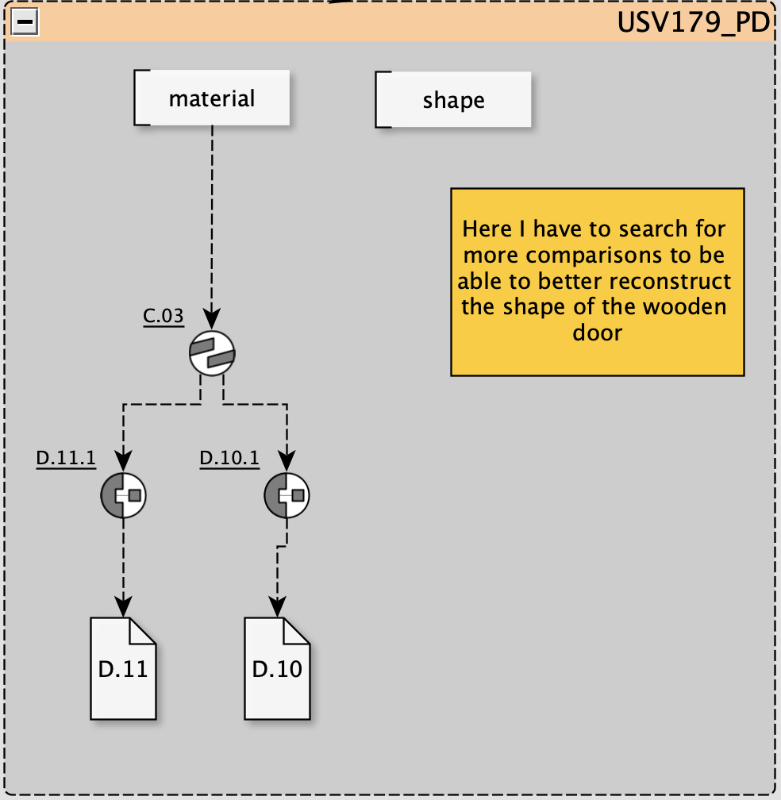

Utilities and Minor Nodes
=========================

The Extended Matrix language includes several utility nodes and minor elements that enhance the functionality and readability of your matrices. This section covers these components, such as the **Comment Node**, which allows you to add annotations directly within your matrix.

Comment Node
------------

The **Comment Node** is a utility node that enables you to insert comments or notes into your Extended Matrix diagram. This is particularly useful for adding explanations, reminders, or any supplementary information that doesn't fit into the standard nodes.

Features of the Comment Node:
~~~~~~~~~~~~~~~~~~~~~~~~~~~~~

- **Visual Distinction**: Comment nodes are typically styled differently to stand out from other nodes,  using a yellow background color.
- **Non-Operational**: They do not affect the operational logic or data flow within the matrix. They are purely informational and serve as in-line documentation, reducing the need to refer to external documents.
- **Collaboration**: Facilitate communication among team members by annotating complex sections of the matrix.
- **Flexibility**: You can place comment nodes anywhere within your matrix to provide context or clarification.

   *Example of use of a comment Node within an Extended Matrix graph.*

Using Comment Nodes:
~~~~~~~~~~~~~~~~~~~~

- **Adding a Comment**: Insert a Comment Node from the node palette and place it in your matrix where the comment is relevant.

- **Content**: Enter your comment text directly into the node. Keep it concise and relevant to the associated elements.