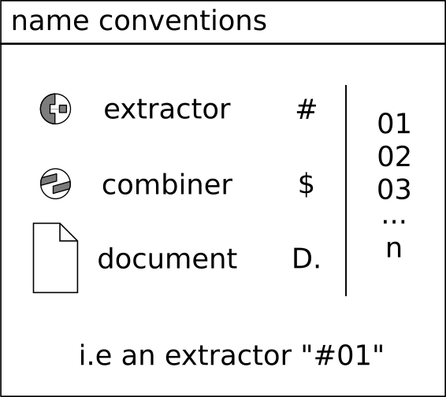
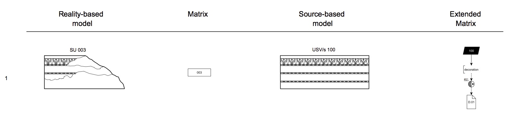
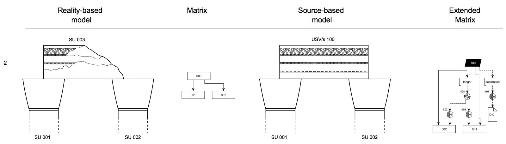
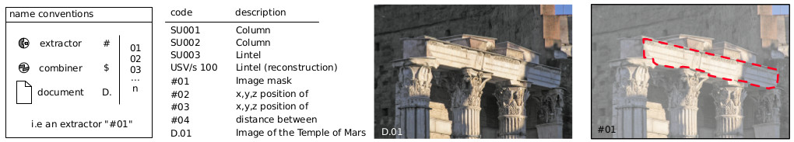

Validation Nodes of the EM
==========================

Validation nodes have a unique name (as well as the USs) in order to be correctly referenced. They follow a name convention model (see Fig. 1): extractor nodes are composed by a “D” plus a sequence of numbers  (i.e the first extractor of an EM will be #01). Combiner and document nodes uses respectively the “C” and “D.” prefix.

.. _validation_nodes_examples_use:

Validation nodes: examples of use
---------------------------------

The USV is a hypothesis with three levels of certainty (structural-non structural-special find reintegration) that have some properties; these properties are based on: sources (nodes), interpretation of sources (extractor nodes) and reasoning (combiner nodes), following the DIKW schema Data-Information-Wisdom-Knowledge.

Example of a property based on a single source
~~~~~~~~~~~~~~~~~~~~~~~~~~~~~~~~~~~~~~~~~~~~~~

There is a fragmentary lintel SU003 and a reconstructed USV/s 100 is provisioned. A “decoration” property is declared and supported by a source D.01 (picture of the Temple of Mars at Rome). The interpretation of the source #01 extracts the part of the source useful to support the property above “decoration”. The content of paradata nodes are visible at paragraph 3.3.

Example of a property based on two sources
~~~~~~~~~~~~~~~~~~~~~~~~~~~~~~~~~~~~~~~~~~

There is a fragmentary lintel SU003 on top of two columns SU001 and SU002. A USV/s 100 provide a hypothesis of virtual reconstruction and two properties are declared: lenght and decoration (see previous paragraph). The lenght property is based on two sources, namely the position of the columns used to extract the overall lenght of the lintel. The content of paradata nodes are visible at paragraph 3.3.

Example of a validation node table
~~~~~~~~~~~~~~~~~~~~~~~~~~~~~~~~~~

List of nodes used in the paragraphs 3.1 and 3.2:

.. _taxonomy:

Taxonomy of the EM
------------------

Validation nodes can have different values. These lists are not “closed”: users of the EM can add values in case of necessity.